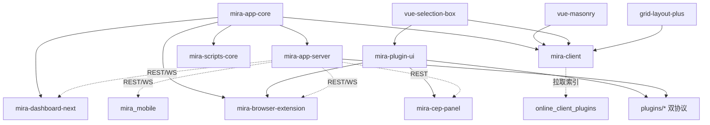

# Mira TypeScript — 新时代的素材管理软件

Mira TypeScript 是基于 TypeScript 的 pnpm workspace monorepo,目标是构建新时代的素材管理软件。核心能力:媒体文件组织/检索/预览/管理(图片/视频/音频/3D/动画/矢量/电子书/归档)、多素材库(独立 SQLite)、**双协议插件架构**(`ServerPlugin` 基类 + `registerFileFormat` 格式注册)、实时 WebSocket、Web 管理面板、n8n 集成、跨平台 Electron 桌面客户端、Chrome 浏览器扩展采集入口、Next.js 落地页。

分层:核心库(`mira-app-core`)→ 服务端(`mira-app-server`)→ 客户端(`mira-client` mira-web,Electron + Vue 3)→ 管理面板(`mira-dashboard-next`),外加 Chrome 扩展、Flutter 移动端(`mira_mobile`)、Photoshop CEP 面板(`mira-cep-panel`)、插件共享 UI 组件库(`mira-plugin-ui`)、瀑布流/框选/栅格组件、脚本工具、VitePress 文档、落地页、服务端插件集合(16 个)与客户端插件市场(`online_client_plugins`)。

> 当前分支:`main`。客户端 shadcn-vue 迁移已完成合并。详见 [packages/mira-client/CLAUDE.md](packages/mira-client/CLAUDE.md)。

## 约定的规则

- TypeScript strict;服务端 CommonJS,客户端 ESM;移动端为 Flutter(Dart ^3.10)
- API 统一响应 `{ code, data, message?, timestamp }`,路由前缀 `/api/`,共 19 个路由模块;SDK(mira-app-core)覆盖 17 个 API 模块,128 条 API covered 117
- **插件双协议**:深度插件(`extends ServerPlugin` 或等价自定义类,`registerRounter` 注册路由,含 web/ SPA 的新三插件)与格式插件 `registerFileFormat(ServerFileFormatHandler)`(声明扩展名/缩略图/查看器);均导出 `init(inst)` 工厂,注册表:`plugins/plugins/plugins.recommend.json`(推荐 11)+ `plugins/plugins/plugins.json`(展示 meta 3)+ 服务端运行时 `src/plugins/plugins.json`(11)
- **客户端 UI 约定**:只用 `@/components/ui`(shadcn-vue),禁用原生控件、禁用直接 import reka-ui、禁用 `--mira-*` 变量;插件侧共享 UI 用 `mira-plugin-ui`
- Electron:Context Isolation 启用,Node Integration 禁用,IPC 经 `contextBridge` 暴露
- 浏览器扩展:跨上下文传文件必须用 `fileToStaged`;MV3 禁 eval
- 服务端 CLI 为多命令结构(`src/cli/commands/`,含 doctor),并内置 MCP 服务(`--mcp` stdio)
- 更多约定见 [claude/conventions.md](claude/conventions.md)

## 文件索引

| 文件 | 用途 | 何时阅读 |
|------|------|----------|
| [claude/overview.md](claude/overview.md) | 架构总览、分层、技术栈 | 首次了解项目 |
| [claude/conventions.md](claude/conventions.md) | 编码/API/插件双协议/安全约定 | 改代码前 |
| [claude/module-index.md](claude/module-index.md) | 全部模块职责 + 13 插件表 + 已移除模块 | 定位模块 |
| [claude/entrypoints.md](claude/entrypoints.md) | 入口与启动编排 | 运行/构建 |
| [claude/public-interfaces.md](claude/public-interfaces.md) | REST/WS/SDK/IPC/CLI 聚合 | 对接接口 |
| [claude/dependencies-and-config.md](claude/dependencies-and-config.md) | 依赖版本、配置、环境变量 | 排查依赖 |
| [claude/data-model.md](claude/data-model.md) | SQLite 实体、消息结构、客户端状态 | 数据层改动 |
| [claude/testing-and-quality.md](claude/testing-and-quality.md) | 测试/lint/质量风险 | 质量评估 |
| [claude/file-map.md](claude/file-map.md) | 目录树与关键文件 | 找文件 |
| [claude/faq.md](claude/faq.md) | 常见问题定位 | 遇到坑 |
| [claude/changelog.md](claude/changelog.md) | 文档索引变更记录 | 看更新历史 |

## 模块索引

| 模块 | 版本 | 职责 | 文档 |
|------|------|------|------|
| mira-app-core | 2.0.8 | 核心库:事件、SQLite 存储、TS SDK(17 模块)、共享类型 | [packages/mira-app-core/CLAUDE.md](packages/mira-app-core/CLAUDE.md) |
| mira-app-server | 2.0.9 | 服务端:Express + WebSocket,19 路由,CLI + MCP,双协议插件管理器 | [packages/mira-app-server/CLAUDE.md](packages/mira-app-server/CLAUDE.md) |
| mira-client | 2.0.9 | Electron 桌面客户端(包名 mira-web):媒体管理、插件、Tab、i18n | [packages/mira-client/CLAUDE.md](packages/mira-client/CLAUDE.md) |
| mira-dashboard-next | 0.0.0 | Web 管理面板:Vue 3 + shadcn-vue + Tailwind 4,API 已迁移到 SDK | [packages/mira-dashboard-next/CLAUDE.md](packages/mira-dashboard-next/CLAUDE.md) |
| mira-browser-extension | 0.1.0 | Chrome MV3 扩展:网页素材采集(截图/拖拽/嗅探/批量上传) | [packages/mira-browser-extension/CLAUDE.md](packages/mira-browser-extension/CLAUDE.md) |
| mira_mobile | 1.0.0+1 | Flutter 移动端:浏览/下载/相册自动备份 | [packages/mira_mobile/CLAUDE.md](packages/mira_mobile/CLAUDE.md) |
| mira-plugin-ui | 1.1.0 | 插件共享 UI 组件库(自包含 dist,CDN 可用;ui 67 目录 + library 媒体库组件族;8 处消费) | [packages/mira-plugin-ui/CLAUDE.md](packages/mira-plugin-ui/CLAUDE.md) |
| grid-layout-plus | 2.0.0-beta.0 | vendored 栅格布局 fork,供 client Home 仪表盘 | [packages/grid-layout-plus/CLAUDE.md](packages/grid-layout-plus/CLAUDE.md) |
| mira-cep-panel | 0.1.0 | Adobe CEP 面板:PS 内浏览/置入 Mira 素材(Chromium 61) | [packages/mira-cep-panel/CLAUDE.md](packages/mira-cep-panel/CLAUDE.md) |
| vue-masonry | 0.1.0 | @hunmer/vue-masonry:Vue 3 瀑布流组件 | [packages/vue-masonry/CLAUDE.md](packages/vue-masonry/CLAUDE.md) |
| vue-selection-box | 0.1.0 | @hunmer/vue-selection-box:Vue 3 框选组件(被 client/plugin-ui 依赖) | [packages/vue-selection-box/CLAUDE.md](packages/vue-selection-box/CLAUDE.md) |
| landing-page | 0.1.0 | efferd-ui:Next.js 16 + React 19 官方落地页(efferd.com,静态导出) | [packages/landing-page/CLAUDE.md](packages/landing-page/CLAUDE.md) |
| mira-scripts-core | 1.0.5 | 脚本工具:数据转换、文件导入 | [packages/mira-scripts-core/CLAUDE.md](packages/mira-scripts-core/CLAUDE.md) |
| mira-doc | 1.0.0 | VitePress 文档站(部署 base /docs/) | [packages/mira-doc/CLAUDE.md](packages/mira-doc/CLAUDE.md) |
| plugins | -- | 服务端插件集合(16 个:5 深度 + 11 格式) | [plugins/CLAUDE.md](plugins/CLAUDE.md) |
| online_client_plugins | -- | 客户端插件市场源仓库(8 个入索引:视频剪辑器/格式预览/以图搜图/白板) | [online_client_plugins/CLAUDE.md](online_client_plugins/CLAUDE.md) |

## 扫描状态

- **更新时间**: 2026-08-23 16:08 CST
- **分支**: main
- **已扫描**: 根目录 + 全部 12 个有文档 packages + plugins/(16 插件) + online_client_plugins/(新建文档);08-20 基线以来约 70 提交(信息均为 "fix")
- **本次更新要点**(增量,基线 2026-08-20):
  - 版本不变(core 2.0.8 / server 2.0.9 / client 2.0.9),纯功能迭代
  - **新建文档 3 处**:grid-layout-plus(vendored fork,10 文件)、mira-cep-panel(CEP 面板,6 文件)、online_client_plugins(插件市场,6 文件)
  - **plugins 14→16**:新增深度插件 mira_image_cropper / mira_format_converter / mira_ai_sdk(「HTTP 路由 + web/ SPA」形态,默认 enabled);recommend 12→11;新增源码侧展示注册表(3 条)
  - **mira-plugin-ui 大扩容**:ui 13 族→67 目录/376 vue(批量导入 shadcn 官方 registry + questionnaire 等扩展块);library 扩为媒体库组件族(15 vue:MediaBrowser/Waterfall/Detail/MediaLibraryView/PickerDialog/FilterBar…);消费方 2→8(+cep-panel、3 插件 web/、3 市场插件)
  - **mira-client**:IPC Handler 18→20(+PluginExec 受控执行、+Screenshot 截图窗口);Dashboard 卡片体系 + grid-layout-plus;WebviewTabView + FaviconCache;ui 52→53(+chart,@unovis)
  - 已删除包确认:mira-server-sdk(-examples)/mira-storage-sqlite/n8n-nodes-mira-ws-trigger 均为 2026-06-09 前移除,磁盘残留不建文档
  - browser-extension / mira_mobile / vue-masonry / vue-selection-box / landing-page:文档核对仍准确,仅补记 changelog
- **跳过/陈旧**: 各包 `node_modules/`、`dist/`、`build/`;plugin-ui 67 目录实现体;video-editor 等市场插件实现体
- **下一步建议**: 为三个新深度插件补建独立 CLAUDE.md;深扫 online_client_plugins/mira-video-editor;client 的 33 个 TS6133 与 vite scss 残留注入待修;`.claude/index.json` 已同步 timestamp
