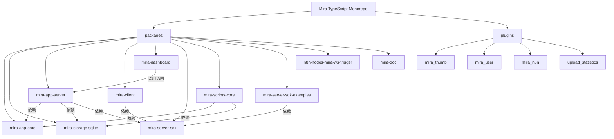

# Mira TypeScript - 智能文件管理与自动化平台

## 变更记录 (Changelog)

| 日期 | 操作 | 说明 |
|------|------|------|
| 2026-05-20 | 初始化架构扫描 | 首次生成完整架构文档，覆盖 10+ 个模块 |

## 项目愿景

Mira TypeScript 是一个基于 TypeScript 的 monorepo 项目，目标是构建一个**智能文件管理与自动化平台**。核心能力包括：

- 媒体文件的组织、检索、预览与管理（图片、视频、音频、文档）
- 多素材库（Library）支持，每个库拥有独立的 SQLite 数据库
- 插件化架构，支持服务端和客户端插件扩展
- 实时 WebSocket 双向通信
- Web 后台管理面板
- n8n 自动化集成
- 跨平台桌面客户端（Electron）

## 架构总览

项目采用 **pnpm workspace monorepo** 结构，分为以下层次：

- **核心层 (core)**: `mira-app-core` 提供事件管理、库列表管理等基础能力；`mira-storage-sqlite` 提供 SQLite 持久化
- **服务层 (server)**: `mira-app-server` 提供 HTTP REST API + WebSocket 服务，管理素材库、插件、用户认证
- **客户端层 (client)**: `mira-client` 基于 Electron + Vue 3 的桌面客户端
- **管理面板 (dashboard)**: `mira-dashboard` 基于 Vben Admin (Vue 3 + Ant Design) 的 Web 管理后台
- **SDK**: `mira-server-sdk` 提供链式调用的 TypeScript SDK，供客户端和外部程序使用
- **工具**: `mira-scripts-core` 数据迁移/导入脚本工具集
- **集成**: `n8n-nodes-mira-ws-trigger` n8n 社区节点，监听 Mira WebSocket 事件
- **文档**: `mira-doc` VitePress 驱动的项目文档站

## 模块结构图



## 模块索引

| 模块 | 路径 | 语言 | 职责 |
|------|------|------|------|
| mira-app-core | `packages/mira-app-core` | TypeScript | 核心库：事件管理器 (EventManager)、库列表持久化、共享类型定义 |
| mira-storage-sqlite | `packages/mira-storage-sqlite` | TypeScript | SQLite 存储实现：文件/文件夹/标签 CRUD、事务管理、缩略图路径 |
| mira-app-server | `packages/mira-app-server` | TypeScript | 服务端：Express HTTP + WebSocket 服务，RESTful API，插件管理，用户认证 |
| mira-client | `packages/mira-client` | TypeScript/Vue 3 | Electron 桌面客户端：媒体浏览/预览/管理，插件系统，Tab 导航 |
| mira-dashboard | `packages/mira-dashboard` | TypeScript/Vue 3 | Web 管理面板：基于 Vben Admin，库管理/插件/设备/管理员/数据库管理 |
| mira-server-sdk | `packages/mira-server-sdk` | TypeScript | TypeScript SDK：链式调用 API 客户端，含 HTTP + WebSocket 模块 |
| mira-scripts-core | `packages/mira-scripts-core` | TypeScript | 脚本工具集：数据转换 (convertLibraryData)、文件导入 (pathFilesToLibrary) |
| mira-server-sdk-examples | `packages/mira-server-sdk-examples` | TypeScript | SDK 示例与测试用例 |
| n8n-nodes-mira-ws-trigger | `packages/n8n-nodes-mira-ws-trigger` | TypeScript | n8n 社区节点：WebSocket 事件触发器 |
| mira-doc | `packages/mira-doc` | Markdown/VitePress | 项目文档站 |
| plugins/* | `plugins/plugins/*` | TypeScript | 服务端插件：缩略图生成 (mira_thumb)、用户管理 (mira_user)、n8n 集成、统计 |

## 运行与开发

### 环境要求

- Node.js >= 18
- pnpm (推荐 >= 9)
- Python (用于 node-gyp / sqlite3 编译)

### 常用命令

```bash
# 安装依赖
pnpm install

# 构建核心模块 + 服务端 + 插件
pnpm run start:server

# 分步构建
pnpm run build:core       # 构建 mira-app-core
pnpm run build:storage    # 构建 mira-storage-sqlite
pnpm run build:server     # 构建 mira-app-server
pnpm run build:sdk        # 构建 mira-server-sdk
pnpm run build:plugins    # 构建所有服务端插件

# 服务端开发
cd packages/mira-app-server
pnpm run dev              # 开发模式启动 (ts-node + inspect)

# 客户端开发
cd packages/mira-client
pnpm run dev              # Vite 开发服务器
pnpm run electron:dev     # Electron 开发模式

# 仪表盘开发
cd packages/mira-dashboard
pnpm run dev:antd         # Ant Design 版本开发

# 文档站
cd packages/mira-doc
pnpm run docs:dev         # VitePress 开发服务器
```

### 环境变量

- `MIRA_SERVER_HTTP_PORT` / `HTTP_PORT`: HTTP 端口 (默认 8081)
- `MIRA_SERVER_WS_PORT` / `WS_PORT`: WebSocket 端口 (默认 8018)
- `DATA_PATH`: 数据目录路径 (默认 `./data`)

## 测试策略

| 模块 | 测试框架 | 测试目录 | 备注 |
|------|----------|----------|------|
| mira-app-server | Jest | `sdk/` | 通过 `pnpm test` 运行 |
| mira-server-sdk | Jest | 根目录 | 通过 `pnpm test` 运行 |
| mira-server-sdk-examples | Jest | `tests/` | 认证/上传专项测试 |
| mira-dashboard | Vitest | 各子包 | 通过 `pnpm test:unit` 运行 |

测试覆盖目前集中在 SDK 层，核心存储层和服务端路由层缺少独立测试。

## 编码规范

- TypeScript strict mode，所有模块使用 `tsconfig.json`
- 服务端代码使用 CommonJS (`require/module.exports`)，客户端使用 ESM
- API 响应统一格式：`{ code: number, data: any, message?: string, timestamp: string }`
- 错误处理：Express 错误中间件统一捕获，WebSocket 使用 `status: 'error'` 响应
- 插件系统：继承 `ServerPlugin` 基类，通过 `plugins.json` 注册
- 命名约定：文件使用 PascalCase (类)、camelCase (函数/变量)

## AI 使用指引

- 修改服务端逻辑时，注意 `mira-app-core` 和 `mira-storage-sqlite` 是独立包，需要分别构建
- 添加新 API 路由时，参考 `packages/mira-app-server/src/routes/` 下现有路由的注册模式
- 添加新 SDK 模块时，参考 `packages/mira-server-sdk/src/modules/` 下现有模块的链式调用模式
- 客户端使用 `mira-server-sdk` 的 ESM 构建与服务端通信
- 仪表盘基于 Vben Admin 框架，路由/菜单/权限系统遵循 Vben 约定
- 插件开发需要同时考虑服务端 (`ServerPlugin`) 和客户端（前端 UI 组件）两侧
