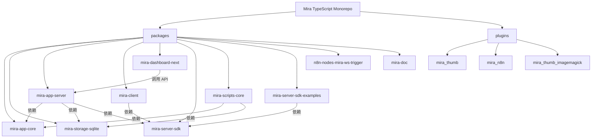

# Mira TypeScript - 智能文件管理与自动化平台

## 变更记录 (Changelog)

| 日期 | 操作 | 说明 |
|------|------|------|
| 2026-05-26 | 增量更新扫描 | 发现重大结构变化：mira-dashboard 替换为 mira-dashboard-next（shadcn-vue 重写）；新增 mira_thumb_imagemagick 插件；服务端新增 ThumbnailService/SettingsManager/ThumbRouter/StatisticsRouter；mira_user/upload_statistics 插件源码已移除 |
| 2026-05-25 | 增量更新扫描 | 更新模块版本号、服务端路由清单（新增 FsRouter、BaseRouter、LibraryWatcher、UserStorage）、插件深度扫描、SDK 模块清单完善 |
| 2026-05-20 | 初始化架构扫描 | 首次生成完整架构文档，覆盖 10+ 个模块 |

## 项目愿景

Mira TypeScript 是一个基于 TypeScript 的 monorepo 项目，目标是构建一个**智能文件管理与自动化平台**。核心能力包括：

- 媒体文件的组织、检索、预览与管理（图片、视频、音频、文档）
- 多素材库（Library）支持，每个库拥有独立的 SQLite 数据库
- 插件化架构，支持服务端和客户端插件扩展
- 实时 WebSocket 双向通信
- Web 后台管理面板
- n8n 自动化集成
- 跨平台桌面客户端（Electron）

## 架构总览

项目采用 **pnpm workspace monorepo** 结构，分为以下层次：

- **核心层 (core)**: `mira-app-core` 提供事件管理、库列表管理等基础能力；`mira-storage-sqlite` 提供 SQLite 持久化
- **服务层 (server)**: `mira-app-server` 提供 HTTP REST API + WebSocket 服务，管理素材库、插件、用户认证，内置 ThumbnailService 和 SettingsManager
- **客户端层 (client)**: `mira-client` 基于 Electron + Vue 3 的桌面客户端
- **管理面板 (dashboard)**: `mira-dashboard-next` 基于 shadcn-vue + Tailwind CSS 4 的 Web 管理后台（替代原 Vben Admin 版本）
- **SDK**: `mira-server-sdk` 提供链式调用的 TypeScript SDK，供客户端和外部程序使用
- **工具**: `mira-scripts-core` 数据迁移/导入脚本工具集
- **集成**: `n8n-nodes-mira-ws-trigger` n8n 社区节点，监听 Mira WebSocket 事件
- **文档**: `mira-doc` VitePress 驱动的项目文档站

## 模块结构图



## 模块索引

| 模块 | 路径 | 语言 | 版本 | 职责 |
|------|------|------|------|------|
| mira-app-core | `packages/mira-app-core` | TypeScript | 1.0.24 | 核心库：事件管理器 (EventManager)、库列表持久化、共享类型定义 (User, Session, WebSocketMessage) |
| mira-storage-sqlite | `packages/mira-storage-sqlite` | TypeScript | 1.0.20 | SQLite 存储实现：文件/文件夹/标签 CRUD、事务管理、缩略图路径、931 行核心实现 |
| mira-app-server | `packages/mira-app-server` | TypeScript | 1.0.25 | 服务端：Express HTTP + WebSocket 服务，15 个路由模块，CLI 工具，用户认证，内置 ThumbnailService |
| mira-client | `packages/mira-client` | TypeScript/Vue 3 | 1.0.3 | Electron 桌面客户端：媒体浏览/预览/管理，插件系统，Tab 导航，10 个 Pinia Store |
| mira-dashboard-next | `packages/mira-dashboard-next` | TypeScript/Vue 3 | 0.0.0 | Web 管理面板：基于 shadcn-vue + Tailwind CSS 4，11 个功能页面 + 认证页面，i18n 支持 |
| mira-server-sdk | `packages/mira-server-sdk` | TypeScript | 1.0.19 | TypeScript SDK：链式调用 API 客户端，10 个 API 模块 + WebSocket + HTTP 双通道 |
| mira-scripts-core | `packages/mira-scripts-core` | TypeScript | 1.0.5 | 脚本工具集：数据转换 (convertLibraryData)、文件导入 (pathFilesToLibrary) |
| mira-server-sdk-examples | `packages/mira-server-sdk-examples` | TypeScript | 1.0.0 | SDK 示例与测试用例：认证、上传、基础/高级用法示例 |
| n8n-nodes-mira-ws-trigger | `packages/n8n-nodes-mira-ws-trigger` | TypeScript | 0.1.3 | n8n 社区节点：WebSocket 事件触发器，支持事件过滤和指数退避重连 |
| mira-doc | `packages/mira-doc` | Markdown/VitePress | 1.0.0 | 项目文档站：VitePress 2.0 驱动，含 API/指南/Dashboard/n8n 文档 |
| mira_thumb | `plugins/plugins/mira_thumb` | TypeScript | 1.0.19 | 服务端插件：缩略图生成 (ffmpeg)，支持图片/视频，队列并发控制 |
| mira_n8n | `plugins/plugins/mira_n8n` | TypeScript | 1.0.7 | 服务端插件：n8n Webhook 集成，独立 WebSocket 服务器转发事件 |
| mira_thumb_imagemagick | `plugins/plugins/mira_thumb_imagemagick` | TypeScript | 1.0.0 | 服务端插件：ImageMagick 缩略图生成，支持 PSD/AI/EPS/SVG/TIFF/DNG/HEIC 等格式 |

**已移除/不可用的模块**：
- `mira-dashboard` (原 Vben Admin 版本) -- 已替换为 `mira-dashboard-next`
- `mira_user` (用户认证插件) -- 源码已移除，plugins.json 中仍有注册
- `upload_statistics` (上传统计插件) -- 源码已移除，功能已内置于服务端 StatisticsRouter

## 运行与开发

### 环境要求

- Node.js >= 18 (dashboard-next 需要 >= 16)
- pnpm (推荐 >= 9)
- Python (用于 node-gyp / sqlite3 编译)
- ffmpeg (用于缩略图生成插件)
- ImageMagick (可选，用于 PSD/AI 等专业格式缩略图)

### 常用命令

```bash
# 安装依赖
pnpm install

# 构建核心模块 + 服务端 + 插件
pnpm run start:server

# 分步构建
pnpm run build:core       # 构建 mira-app-core
pnpm run build:storage    # 构建 mira-storage-sqlite
pnpm run build:server     # 构建 mira-app-server
pnpm run build:sdk        # 构建 mira-server-sdk (含 ESM + CJS)
pnpm run build:plugins    # 构建所有服务端插件

# 服务端开发
cd packages/mira-app-server
pnpm run dev              # 开发模式启动 (ts-node + inspect)

# 客户端开发
cd packages/mira-client
pnpm run dev              # Vite 开发服务器
pnpm run electron:dev     # Electron 开发模式

# 管理面板开发
cd packages/mira-dashboard-next
pnpm run dev              # Vite 开发服务器

# 文档站
cd packages/mira-doc
pnpm run docs:dev         # VitePress 开发服务器
```

### 环境变量

- `MIRA_SERVER_HTTP_PORT` / `HTTP_PORT`: HTTP 端口 (默认 8081)
- `MIRA_SERVER_WS_PORT` / `WS_PORT`: WebSocket 端口 (默认 8018)
- `DATA_PATH`: 数据目录路径 (默认 `./data`)
- `FFMPEG_PATH`: ffmpeg 可执行文件路径 (缩略图插件使用)
- `MAGICK_PATH`: ImageMagick 可执行文件路径 (mira_thumb_imagemagick 插件使用)

## 测试策略

| 模块 | 测试框架 | 测试目录 | 备注 |
|------|----------|----------|------|
| mira-app-server | Jest | `sdk/` | 通过 `pnpm test` 运行 |
| mira-server-sdk | Jest | `tests/` | 16 个源文件，含 HttpClient/AuthModule/MiraClient 集成测试 |
| mira-server-sdk-examples | Jest | `tests/` | 认证/上传专项测试 |
| mira-dashboard-next | (未配置) | -- | 尚未建立测试框架 |

测试覆盖目前集中在 SDK 层，核心存储层和服务端路由层缺少独立测试。

## 编码规范

- TypeScript strict mode，所有模块使用 `tsconfig.json`
- 服务端代码使用 CommonJS (`require/module.exports`)，客户端使用 ESM
- API 响应统一格式：`{ code: number, data: any, message?: string, timestamp: string }`
- 错误处理：Express 错误中间件统一捕获，WebSocket 使用 `status: 'error'` 响应
- 插件系统：继承 `ServerPlugin` 基类，通过 `plugins.json` 注册，导出 `init()` 函数
- 命名约定：文件使用 PascalCase (类)、camelCase (函数/变量)
- 插件必须导出 `init(inst): PluginClass` 工厂函数

## AI 使用指引

- 修改服务端逻辑时，注意 `mira-app-core` 和 `mira-storage-sqlite` 是独立包，需要分别构建
- 添加新 API 路由时，参考 `packages/mira-app-server/src/routes/` 下现有路由的注册模式（继承 `BaseRouter` 或直接注册）
- 添加新 SDK 模块时，参考 `packages/mira-server-sdk/src/modules/` 下现有模块的链式调用模式
- 客户端使用 `mira-server-sdk` 的 ESM 构建与服务端通信
- `mira-dashboard-next` 使用 shadcn-vue 组件库，不再是 Vben Admin
- 插件开发需要同时考虑服务端 (`ServerPlugin`) 和客户端（前端 UI 组件）两侧
- 插件可注册 HTTP Hook 拦截请求、监听事件管理器事件、注册前端路由
- WebSocket 消息格式：`{ action, requestId, libraryId, clientId, payload: { type, data } }`
- 缩略图系统现在有内置 `ThumbnailService`（服务端核心）和插件扩展（`mira_thumb_imagemagick` 通过 `registerGenerator` 注册）
