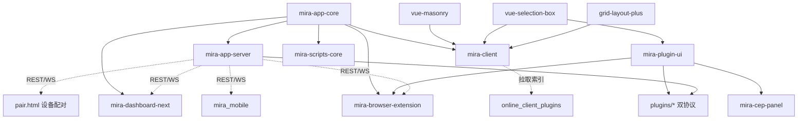

# Mira TypeScript — 新时代的素材管理软件

Mira TypeScript 是基于 TypeScript 的 pnpm workspace monorepo,目标是构建新时代的素材管理软件。核心能力:媒体文件组织/检索/预览/管理(图片/视频/音频/3D/动画/矢量/电子书/归档)、多素材库(独立 SQLite)、**双协议插件架构**(`ServerPlugin` 基类 + `registerFileFormat` 格式注册)、实时 WebSocket(含设备间二进制端到端转发)、Web 管理面板、n8n 集成、跨平台 Electron 桌面客户端、Chrome 浏览器扩展采集入口、Next.js 落地页。

分层:核心库(`mira-app-core`)→ 服务端(`mira-app-server`)→ 客户端(`mira-client` mira-web,Electron + Vue 3)→ 管理面板(`mira-dashboard-next`),外加 Chrome 扩展、Flutter 移动端(`mira_mobile`)、Photoshop CEP 面板(`mira-cep-panel`)、插件共享 UI 组件库(`mira-plugin-ui`)、瀑布流/框选/栅格组件、脚本工具、VitePress 文档、落地页、服务端插件集合(16 个)与客户端插件市场(`online_client_plugins`,5 个)。

> 当前分支:`main`。**core/server/client 已同步升至 v3.0.1**(v3.0.0 引入文件导入三模式/设备间分享/Eagle·Billfish 跨库导入等大特性)。详见 [packages/mira-client/CLAUDE.md](packages/mira-client/CLAUDE.md)。

## 约定的规则

- TypeScript strict;服务端 CommonJS,客户端 ESM;移动端为 Flutter(Dart ^3.10)
- API 统一响应 `{ code, data, message?, timestamp }`,路由前缀 `/api/`,共 19 个路由模块;SDK(mira-app-core)覆盖 17 个 API 模块,固定 JSON API 138 条 covered 125(`.audit/sdk-coverage-report.md`,2026-08-24)
- **文件导入三模式**:`copy`(完整副本,`files.path=NULL`)/`move`(复制后源文件进系统回收站)/`link`(符号链接,Windows EPERM 回退硬链接;`path` 存源路径);库级 `customFields.importType` 配置,见 `docs/library-import-modes.md`
- **插件双协议**:深度插件(`extends ServerPlugin` 或等价自定义类,`registerRounter` 注册路由,含 web/ SPA 的新三插件)与格式插件 `registerFileFormat(ServerFileFormatHandler)`(声明扩展名/缩略图/查看器);均导出 `init(inst)` 工厂,注册表:`plugins/plugins/plugins.recommend.json`(推荐 11)+ `plugins/plugins/plugins.json`(展示 meta 3)+ 服务端运行时 `src/plugins/plugins.json`(11)
- **客户端 UI 约定**:只用 `@/components/ui`(shadcn-vue),禁用原生控件、禁用直接 import reka-ui、禁用 `--mira-*` 变量;插件侧共享 UI 用 `mira-plugin-ui`
- Electron:Context Isolation 启用,Node Integration 禁用,IPC 经 `contextBridge` 暴露
- 浏览器扩展:跨上下文传文件必须用 `fileToStaged`;MV3 禁 eval
- 服务端 CLI 为多命令结构(`src/cli/commands/`,含 doctor),并内置 MCP 服务(`--mcp` stdio)
- 插件运行时数据(`plugins/plugins/*/data/`)一律 git 忽略,勿提交
- 更多约定见 [claude/conventions.md](claude/conventions.md)

## 文件索引

| 文件 | 用途 | 何时阅读 |
|------|------|----------|
| [claude/overview.md](claude/overview.md) | 架构总览、分层、技术栈 | 首次了解项目 |
| [claude/conventions.md](claude/conventions.md) | 编码/API/插件双协议/安全约定 | 改代码前 |
| [claude/module-index.md](claude/module-index.md) | 全部模块职责 + 16 插件表 + 在线插件表 + 已移除模块 | 定位模块 |
| [claude/entrypoints.md](claude/entrypoints.md) | 入口与启动编排 | 运行/构建 |
| [claude/public-interfaces.md](claude/public-interfaces.md) | REST/WS/SDK/IPC/CLI 聚合 | 对接接口 |
| [claude/dependencies-and-config.md](claude/dependencies-and-config.md) | 依赖版本、配置、环境变量 | 排查依赖 |
| [claude/data-model.md](claude/data-model.md) | SQLite 实体、消息结构、客户端状态 | 数据层改动 |
| [claude/testing-and-quality.md](claude/testing-and-quality.md) | 测试/lint/质量风险 | 质量评估 |
| [claude/file-map.md](claude/file-map.md) | 目录树与关键文件 | 找文件 |
| [claude/faq.md](claude/faq.md) | 常见问题定位 | 遇到坑 |
| [claude/changelog.md](claude/changelog.md) | 文档索引变更记录 | 看更新历史 |

## 模块索引

| 模块 | 版本 | 职责 | 文档 |
|------|------|------|------|
| mira-app-core | 3.0.1 | 核心库:事件、SQLite 存储(导入三模式)、TS SDK(17 模块)、共享类型 | [packages/mira-app-core/CLAUDE.md](packages/mira-app-core/CLAUDE.md) |
| mira-app-server | 3.0.1 | 服务端:Express + WebSocket(二进制转发),19 路由,CLI + MCP,双协议插件管理器,Eagle/Billfish 导入 | [packages/mira-app-server/CLAUDE.md](packages/mira-app-server/CLAUDE.md) |
| mira-client | 3.0.1 | Electron 桌面客户端(包名 mira-web):媒体管理、插件、Tab、i18n、设备分享、多库多开窗口 | [packages/mira-client/CLAUDE.md](packages/mira-client/CLAUDE.md) |
| mira-dashboard-next | 0.0.0 | Web 管理面板:Vue 3 + shadcn-vue + Tailwind 4,API 已迁移到 SDK,含 /server 运维页(super) | [packages/mira-dashboard-next/CLAUDE.md](packages/mira-dashboard-next/CLAUDE.md) |
| mira-browser-extension | 0.0.1 | Chrome MV3 扩展:网页素材采集(截图/拖拽/嗅探/批量上传) | [packages/mira-browser-extension/CLAUDE.md](packages/mira-browser-extension/CLAUDE.md) |
| mira_mobile | 1.0.0+1 | Flutter 移动端:浏览/下载/相册自动备份 | [packages/mira_mobile/CLAUDE.md](packages/mira_mobile/CLAUDE.md) |
| mira-plugin-ui | 1.1.0 | 插件共享 UI 组件库(自包含 dist,CDN 可用;ui 67 目录 + library 媒体库组件族;8 处消费) | [packages/mira-plugin-ui/CLAUDE.md](packages/mira-plugin-ui/CLAUDE.md) |
| grid-layout-plus | 2.0.0-beta.0 | vendored 栅格布局 fork,供 client Home 仪表盘 | [packages/grid-layout-plus/CLAUDE.md](packages/grid-layout-plus/CLAUDE.md) |
| mira-cep-panel | 0.1.0 | Adobe CEP 面板:PS 内浏览/置入 Mira 素材(Chromium 61) | [packages/mira-cep-panel/CLAUDE.md](packages/mira-cep-panel/CLAUDE.md) |
| vue-masonry | 0.1.0 | @hunmer/vue-masonry:Vue 3 瀑布流组件 | [packages/vue-masonry/CLAUDE.md](packages/vue-masonry/CLAUDE.md) |
| vue-selection-box | 0.1.0 | @hunmer/vue-selection-box:Vue 3 框选组件(被 client/plugin-ui 依赖) | [packages/vue-selection-box/CLAUDE.md](packages/vue-selection-box/CLAUDE.md) |
| landing-page | 0.1.0 | efferd-ui:Next.js 16 + React 19 官方落地页(efferd.com,静态导出) | [packages/landing-page/CLAUDE.md](packages/landing-page/CLAUDE.md) |
| mira-scripts-core | 1.0.5 | 脚本工具:数据转换、文件导入 | [packages/mira-scripts-core/CLAUDE.md](packages/mira-scripts-core/CLAUDE.md) |
| mira-doc | 1.0.0 | VitePress 文档站(部署 base /docs/) | [packages/mira-doc/CLAUDE.md](packages/mira-doc/CLAUDE.md) |
| plugins | -- | 服务端插件集合(16 个:5 深度 + 11 格式,全部有独立 CLAUDE.md) | [plugins/CLAUDE.md](plugins/CLAUDE.md) |
| online_client_plugins | -- | 客户端插件市场源仓库(5 个入索引:视频剪辑器/以图搜图/白板/2 Demo) | [online_client_plugins/CLAUDE.md](online_client_plugins/CLAUDE.md) |

## 扫描状态

- **更新时间**: 2026-08-25 23:01 CST
- **分支**: main
- **已扫描**: 基线 2026-08-23(2d1710c1)以来全部 58 个提交、579 个变更文件,按包聚合后四路深扫(plugins 三深度插件 / online_client_plugins / mira-client / server+core+dashboard+根目录)
- **本次更新要点**(增量,基线 2026-08-23):
  - **版本 2.x → 3.0.1**(core/server/client 同步;v3.0.0 = 导入三模式 + 设备间分享 + Eagle/Billfish 跨库导入;v3.0.1 = procm-mcp-sdk 改 npm 包)
  - **文件导入三模式**:core `FileImport` 重构(copy `path=NULL`/move 进系统回收站/link 符号链接 + Win 硬链接回退),server 上传走 `customFields.importType`,新文档 `docs/library-import-modes.md`
  - **设备间分享全链路**:server 分享票据(`POST /api/devices/share-tickets` + 免认证 `GET /api/devices/share/:ticketId`,TTL 30 分钟)、WS 二进制端到端转发、`public/pair.html` 扫码配对页(免构建,吃 `public/vendor/` + `public/sdk/mira-sdk.esm.mjs`);client `DeviceShareDialog`(6 文件,含 binaryTransfer)+ FileSharePanel + ui +attachment/dropzone 等
  - **Eagle/Billfish 跨库导入**:server `LibraryImportService`(484 行,异步任务/进度/取消)+ 3 条 `/api/libraries/import*` 端点;dashboard `ImportDialog`
  - **SDK**:模块仍 17 个,新增 createShareTicket / user readFile·writeFile / importFrom·进度·取消 / scanDuplicates matchMode;WebSocketClient 跨 Node·浏览器适配 + sendBinary;覆盖率 138/125(08-24 重生成,`.audit/`)
  - **plugins 16 个文档齐全**:补建 image_cropper/format_converter/ai_sdk 三个 CLAUDE.md;清理 librarys*.json、插件 data/ 运行时文件
  - **online_client_plugins 8→5**:3D/Spine/PSD/Pinterest-v2 于 08-24 撤下;完成 video-editor 深扫
  - **mira-client**:ui 53→58 目录,IPC 19 个 handler(修正此前 20 的口径,以 handlers.ts 实例化计),HomeView 侧边栏拆分(886 行→8 文件)、LocalFolderTabView 拆分、设置分区 10→7、ESLint 9 flat config、`test:split-tabs` node 测试、按库多开窗口、qrcode 依赖
  - **dashboard**:settings 拆 5 面板、新 /server 运维页(SSE 日志,仅 super)、插件源迁到服务端设置
  - **根目录清理**:`.claude/`、`.zcode/plans`、`tool.js`、`deploy.bat`、`skills-lock.json`、`data/librarys.json` 等删除;README 重构为 pnpm 流程;`scripts/materialize-procm-sdk.mjs` 废弃删除;新增一键安装脚本 bin 包装
- **跳过/陈旧**: 各包 `node_modules/`、`dist/`、`build/`;plugin-ui 67 目录实现体;client 子目录级 CLAUDE.md(renderer/views 等仅 tabs/ 已随代码更新)
- **下一步建议**: client 的 `claude/overview·file-map·module-responsibilities` 未随本次大改逐节重写(侧边栏/LocalFolder 拆分等),建议下次深扫;`.audit/` 工具链(decide.ts/gen-manifests.ts 等)无文档;33 个预存 TS6133 是否仍在待复测
