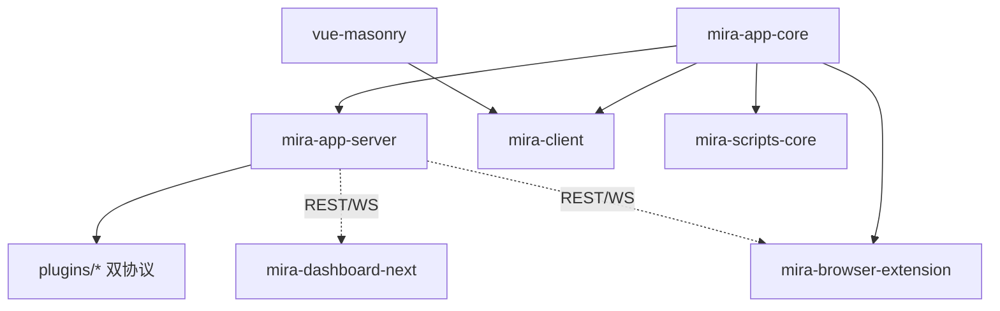

# Mira TypeScript — 新时代的素材管理软件

Mira TypeScript 是基于 TypeScript 的 pnpm workspace monorepo,目标是构建新时代的素材管理软件。核心能力:媒体文件组织/检索/预览/管理(图片/视频/音频/3D/动画/矢量/电子书/归档)、多素材库(独立 SQLite)、**双协议插件架构**(`ServerPlugin` 基类 + `registerFileFormat` 格式注册)、实时 WebSocket、Web 管理面板、n8n 集成、跨平台 Electron 桌面客户端、Chrome 浏览器扩展采集入口、Next.js 落地页。

分层:核心库(`mira-app-core`)→ 服务端(`mira-app-server`)→ 客户端(`mira-client` mira-web,Electron + Vue 3)→ 管理面板(`mira-dashboard-next`),外加 Chrome 扩展、瀑布流组件、脚本工具、VitePress 文档、落地页、服务端插件集合(13 个)。

> 当前分支:`main`。客户端 shadcn-vue 迁移已完成合并。详见 [packages/mira-client/CLAUDE.md](packages/mira-client/CLAUDE.md)。

## 约定的规则

- TypeScript strict;服务端 CommonJS,客户端 ESM
- API 统一响应 `{ code, data, message?, timestamp }`,路由前缀 `/api/`,共 19 个路由模块
- **插件双协议**:旧 `extends ServerPlugin`(深度介入服务端);新 `registerFileFormat(ServerFileFormatHandler)`(声明扩展名/缩略图/查看器);均经 `plugins/plugins.json` 注册,导出 `init(inst)` 工厂
- **客户端 UI 约定**:只用 `@/components/ui`(shadcn-vue),禁用原生控件、禁用直接 import reka-ui、禁用 `--mira-*` 变量
- Electron:Context Isolation 启用,Node Integration 禁用,IPC 经 `contextBridge` 暴露
- 浏览器扩展:跨上下文传文件必须用 `fileToStaged`;MV3 禁 eval
- 更多约定见 [claude/conventions.md](claude/conventions.md)

## 文件索引

| 文件 | 用途 | 何时阅读 |
|------|------|----------|
| [claude/overview.md](claude/overview.md) | 架构总览、分层、技术栈 | 首次了解项目 |
| [claude/conventions.md](claude/conventions.md) | 编码/API/插件双协议/安全约定 | 改代码前 |
| [claude/module-index.md](claude/module-index.md) | 全部模块职责 + 13 插件表 + 已移除模块 | 定位模块 |
| [claude/entrypoints.md](claude/entrypoints.md) | 入口与启动编排 | 运行/构建 |
| [claude/public-interfaces.md](claude/public-interfaces.md) | REST/WS/SDK/IPC/CLI 聚合 | 对接接口 |
| [claude/dependencies-and-config.md](claude/dependencies-and-config.md) | 依赖版本、配置、环境变量 | 排查依赖 |
| [claude/data-model.md](claude/data-model.md) | SQLite 实体、消息结构、客户端状态 | 数据层改动 |
| [claude/testing-and-quality.md](claude/testing-and-quality.md) | 测试/lint/质量风险 | 质量评估 |
| [claude/file-map.md](claude/file-map.md) | 目录树与关键文件 | 找文件 |
| [claude/faq.md](claude/faq.md) | 常见问题定位 | 遇到坑 |
| [claude/changelog.md](claude/changelog.md) | 文档索引变更记录 | 看更新历史 |

## 模块索引

| 模块 | 版本 | 职责 | 文档 |
|------|------|------|------|
| mira-app-core | 2.0.3 | 核心库:事件、SQLite 存储、TS SDK、共享类型 | [packages/mira-app-core/CLAUDE.md](packages/mira-app-core/CLAUDE.md) |
| mira-app-server | 2.0.3 | 服务端:Express + WebSocket,19 路由,CLI,双协议插件管理器 | [packages/mira-app-server/CLAUDE.md](packages/mira-app-server/CLAUDE.md) |
| mira-client | 1.0.5 | Electron 桌面客户端(包名 mira-web):媒体管理、插件、Tab | [packages/mira-client/CLAUDE.md](packages/mira-client/CLAUDE.md) |
| mira-dashboard-next | 0.0.0 | Web 管理面板:Vue 3 + shadcn-vue + Tailwind 4 | [packages/mira-dashboard-next/CLAUDE.md](packages/mira-dashboard-next/CLAUDE.md) |
| mira-browser-extension | 0.1.0 | Chrome MV3 扩展:网页素材采集(截图/拖拽/嗅探) | [packages/mira-browser-extension/CLAUDE.md](packages/mira-browser-extension/CLAUDE.md) |
| vue-masonry | 0.1.0 | @hunmer/vue-masonry:Vue 3 瀑布流组件(被 mira-client 依赖) | [packages/vue-masonry/CLAUDE.md](packages/vue-masonry/CLAUDE.md) |
| landing-page | 0.1.0 | efferd-ui:Next.js 16 + React 19 官方落地页(独立) | [packages/landing-page/CLAUDE.md](packages/landing-page/CLAUDE.md) |
| mira-scripts-core | 1.0.5 | 脚本工具:数据转换、文件导入 | [packages/mira-scripts-core/CLAUDE.md](packages/mira-scripts-core/CLAUDE.md) |
| mira-doc | 1.0.0 | VitePress 文档站 | [packages/mira-doc/CLAUDE.md](packages/mira-doc/CLAUDE.md) |
| plugins | -- | 服务端插件集合(13 个:mira_n8n / 3 格式协议类 / pdf/psd 等) | [plugins/CLAUDE.md](plugins/CLAUDE.md) |

## 扫描状态

- **更新时间**: 2026-08-11
- **分支**: main(shadcn-vue 迁移已合并)
- **已扫描**: 根目录 + 全部 9 个 packages + plugins/(13 插件,基于 `index.ts` + `package.json` 抽样) + online_client_plugins 概览
- **本次更新要点**:
  - core/server 版本 2.0.1 → 2.0.3;server 路由 15 → 19
  - 新增模块:mira-browser-extension、vue-masonry、landing-page(补索引)
  - plugins 从 3 个扩到 13 个;识别插件**双协议**(`ServerPlugin` vs `registerFileFormat`)
  - 标注 `mira_thumb_imagemagick` 已移除;workspace.yaml 仍含 2 条陈旧条目
- **跳过/陈旧**: 各包 `node_modules/`、`dist/`(`pnpm-workspace.yaml` 陈旧条目已于本次清理)
- **下一步建议**: 补 plugins/ 下 13 个插件的独立 `CLAUDE.md`(当前仅 mira_n8n/psd-viewer 有);核对 `online_client_plugins/plugins/*` 与 `plugins/plugins/*/web` 的对应关系;清理 `dependency-switch-config-*.json` 中 `n8n-nodes-mira-ws-trigger` 悬空引用
