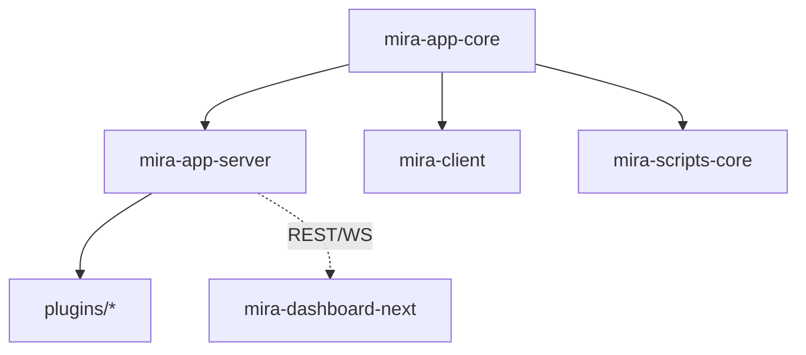

# Mira TypeScript — 新时代的素材管理软件

Mira TypeScript 是基于 TypeScript 的 pnpm workspace monorepo,目标是构建新时代的素材管理软件。核心能力:媒体文件组织/检索/预览/管理、多素材库(独立 SQLite)、插件化架构、实时 WebSocket、Web 管理面板、n8n 集成、跨平台 Electron 桌面客户端。

分层:核心库(`mira-app-core`)→ 服务端(`mira-app-server`)→ 客户端(`mira-client`,Electron + Vue 3)→ 管理面板(`mira-dashboard-next`),外加脚本工具、VitePress 文档、服务端插件集合。

> 当前焦点:客户端 `chore/shadcn-vue-migration` 分支 — UI 已迁移到 shadcn-vue(new-york,Tailwind v4),处于迁移晚期。详见 [packages/mira-client/CLAUDE.md](packages/mira-client/CLAUDE.md)。

## 约定的规则

- TypeScript strict;服务端 CommonJS,客户端 ESM
- API 统一响应 `{ code, data, message?, timestamp }`,路由前缀 `/api/`
- 插件继承 `ServerPlugin`,导出 `init(inst)` 工厂,经 `plugins.json` 注册
- **客户端 UI 约定**:只用 `@/components/ui`(shadcn-vue),禁用原生控件、禁用直接 import reka-ui、禁用 `volt/` 与 `--mira-*` 变量
- Electron:Context Isolation 启用,Node Integration 禁用,IPC 经 `contextBridge` 暴露
- 更多约定见 [claude/conventions.md](claude/conventions.md)

## 文件索引

| 文件 | 用途 | 何时阅读 |
|------|------|----------|
| [claude/overview.md](claude/overview.md) | 架构总览、分层、技术栈 | 首次了解项目 |
| [claude/conventions.md](claude/conventions.md) | 编码/API/插件/安全约定与环境变量 | 改代码前 |
| [claude/module-index.md](claude/module-index.md) | 全部模块职责 + 已移除模块 | 定位模块 |
| [claude/entrypoints.md](claude/entrypoints.md) | 入口与启动编排 | 运行/构建 |
| [claude/public-interfaces.md](claude/public-interfaces.md) | REST/WS/SDK/IPC/CLI 聚合 | 对接接口 |
| [claude/dependencies-and-config.md](claude/dependencies-and-config.md) | 依赖版本、配置、环境变量 | 排查依赖 |
| [claude/data-model.md](claude/data-model.md) | SQLite 实体、消息结构、客户端状态 | 数据层改动 |
| [claude/testing-and-quality.md](claude/testing-and-quality.md) | 测试/lint/质量风险 | 质量评估 |
| [claude/file-map.md](claude/file-map.md) | 目录树与关键文件 | 找文件 |
| [claude/faq.md](claude/faq.md) | 常见问题定位 | 遇到坑 |
| [claude/changelog.md](claude/changelog.md) | 文档索引变更记录 | 看更新历史 |

## 模块索引

| 模块 | 版本 | 职责 | 文档 |
|------|------|------|------|
| mira-app-core | 2.0.1 | 核心库:事件、SQLite 存储、TypeScript SDK、共享类型 | [packages/mira-app-core/CLAUDE.md](packages/mira-app-core/CLAUDE.md) |
| mira-app-server | 2.0.1 | 服务端:Express + WebSocket,15 路由,CLI,缩略图 | [packages/mira-app-server/CLAUDE.md](packages/mira-app-server/CLAUDE.md) |
| mira-client | 1.0.5 | Electron 桌面客户端:媒体管理、插件、Tab(shadcn-vue 迁移中) | [packages/mira-client/CLAUDE.md](packages/mira-client/CLAUDE.md) |
| mira-dashboard-next | 0.0.0 | Web 管理面板:Vue 3 + shadcn-vue + Tailwind 4 | [packages/mira-dashboard-next/CLAUDE.md](packages/mira-dashboard-next/CLAUDE.md) |
| mira-scripts-core | 1.0.5 | 脚本工具:数据转换、文件导入 | [packages/mira-scripts-core/CLAUDE.md](packages/mira-scripts-core/CLAUDE.md) |
| mira-doc | 1.0.0 | VitePress 文档站 | [packages/mira-doc/CLAUDE.md](packages/mira-doc/CLAUDE.md) |
| plugins | -- | 服务端插件集合(mira_n8n / mira_thumb_imagemagick / mira_duplicate_scanner) | [plugins/CLAUDE.md](plugins/CLAUDE.md) |

## 扫描状态

- **更新时间**: 2026-08-05T19:24:30+08:00
- **分支**: chore/shadcn-vue-migration
- **已扫描**: 根目录 + mira-client(深扫,含 UI 迁移现状);core/server/dashboard/scripts/doc 由并行子任务覆盖(基于 package.json 与结构样本)
- **跳过/陈旧**: `pnpm-workspace.yaml` 两条陈旧包条目(磁盘不存在);`packages/mira-client/tailwind.config.js`(v3 死文件)
- **下一步建议**: 深扫 `packages/mira-app-server/src` 路由层与 `mira-app-core/src/storage/sqlite` 表结构;核对各 sibling 包 `claude/` 是否已由子任务落地
