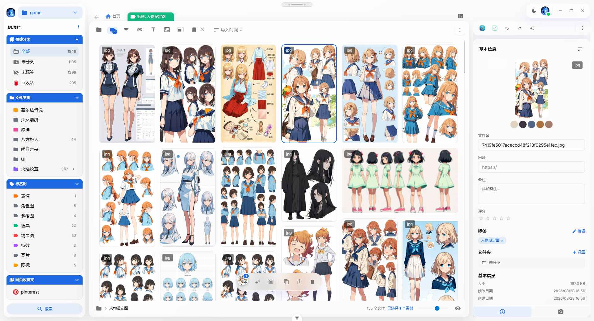

<div align="center">
  

  <h1>Mira</h1>

  <p>现代化媒体资源管理系统，包含后端服务和前端管理面板。</p>

  <p>
    <a href="https://github.com/hunmer/mira/actions/workflows/docker.yml">
      
    </a>
    <a href="https://github.com/hunmer/mira/actions/workflows/electron-windows.yml">
      
    </a>
    <a href="https://github.com/hunmer/mira/actions/workflows/electron-macos.yml">
      
    </a>
  </p>

  <p>
    <a href="https://github.com/hunmer/mira/stargazers">
      
    </a>
    <a href="https://github.com/hunmer/mira/releases">
      
    </a>
    <a href="https://github.com/hunmer/mira/issues">
      
    </a>
    <a href="./LICENSE"></a>
  </p>
</div>

---

<div align="center">
  
</div>

## 一键安装（推荐）

从 [GitHub Releases](https://github.com/hunmer/mira/releases) 下载对应平台的一体化安装包并运行安装脚本，无需手动准备 Node.js、ffmpeg 等任何依赖。

### Windows

1. 下载 `mira-windows-full-<版本号>.zip` 并解压
2. 右键 `install-mira-windows.ps1`，点击【使用 PowerShell 运行】
3. 等待几分钟，看到 `Mira installation complete.` 即完成

若右键菜单没有【使用 PowerShell 运行】或提示"禁止运行脚本"，在 PowerShell 中执行：

```powershell
powershell -ExecutionPolicy Bypass -File .\install-mira-windows.ps1
```

### macOS

1. 下载 `mira-macos-full-<版本号>.zip` 并解压
2. 在终端中进入解压目录并运行：

```bash
./install-mira-macos.sh
```

### 安装脚本会做什么

- 自动安装 Node.js（如未检测到）与 ffmpeg / ImageMagick / ExifTool 运行时
- 部署 Mira Server 并注册为开机自启（Windows 计划任务 / macOS LaunchAgent）
- 安装桌面客户端（Electron）
- 创建默认素材库 `MyLibrary`（位于 `~/mira-libraries/my-library`）

安装完成后打开浏览器访问 **http://127.0.0.1:8081**，默认账号 `admin` / `admin123`（请尽快修改密码）。

更新与卸载：运行包内 `update-mira-windows.ps1` / `uninstall-mira-windows.ps1`（macOS 对应 `uninstall-mira-macos.sh`）。卸载不会删除你的素材数据。

## npm 安装（进阶）

只需后端服务、或希望在服务器/NAS 上部署时，可以直接安装 [mira-app-server](./packages/mira-app-server/README.md)：

```bash
# 全局安装
npm install -g mira-app-server

# 使用默认配置启动（HTTP 8081 + WebSocket 8018）
mira-app-server

# 自定义端口与数据目录
mira-app-server --http-port 8081 --ws-port 8018 --data-path /path/to/your/data

# 查看帮助
mira-app-server --help
```

首次启动会自动创建管理员账号 `admin` / `admin123`（密码打印在服务器日志中）。

## CLI（命令行操作）

`mira-app-server` 不止能启动服务器，还封装了完整 SDK 能力，支持登录、凭证管理与对素材库/文件/标签/文件夹/插件/设备/数据库的增删改查。

### 登录与凭证

凭证持久化到 `~/.mira/credentials.json`，支持多个命名 profile，登录一次后续命令自动复用。

```bash
mira-app-server login -u admin -p admin123              # 登录（默认 http://localhost:8081）
mira-app-server login -u alice -p pw -s http://other-host:8081 --profile prod
mira-app-server auth use prod                           # 切换 profile
mira-app-server auth list                               # 列出所有 profile（* 标记当前）
mira-app-server whoami                                  # 查看当前登录用户
mira-app-server logout                                  # 登出当前 profile
```

### 常用命令

```bash
# 全局选项：-s/--server、--token、--profile、--json（输出原始 JSON，便于脚本解析）
mira-app-server libraries list                       # 素材库列表
mira-app-server libraries create -n MyLib -p /data/lib1 --desc "我的库"
mira-app-server files list <libraryId>               # 文件列表（支持 --title/--ext/--tag 过滤）
mira-app-server files upload <libraryId> /path/a.mp4 /path/b.png --tag 精选
mira-app-server tags create <libraryId> "重要标签" --color 2
mira-app-server folders create <libraryId> "我的文件夹"
mira-app-server plugins list
mira-app-server db tables <libraryId>                # 查看素材库数据库表
mira-app-server system health                        # 健康检查（无需登录）
```

每个子命令均支持 `--help` 查看完整参数。完整参考见 [mira-app-server README](./packages/mira-app-server/README.md) 与项目内 `.agents/skills/mira-cli/` 文档。

## MCP 服务（`--mcp`）

`mira-app-server --mcp` 可作为 **Model Context Protocol (MCP)** 服务运行，通过 stdio 与 MCP 客户端（如 Claude、其它 Agent）通信，把全部能力暴露为 50 个可调用的工具——这是 Agent 以编程方式接入 Mira 的推荐方式。

```json
{
  "mcpServers": {
    "mira": {
      "command": "mira-app-server",
      "args": ["--mcp", "-s", "http://localhost:8081"]
    }
  }
}
```

- 工具命名 `<模块>_<动作>`（如 `libraries_list`、`files_upload`），与 CLI 子命令一一对应
- 鉴权与 CLI 一致：预先 `login` 或先调用 `auth_login` 工具；`system_health` / `system_info` 无需登录
- 详细说明见 [mira-app-server README](./packages/mira-app-server/README.md#mcp-服务---mcp)

## 项目架构

```
mira_typescript/
├── packages/
│   ├── mira-app-core/          # 核心库（SDK / 存储 / 事件）
│   ├── mira-app-server/        # 后端服务（HTTP + WebSocket）
│   ├── mira-client/            # 桌面客户端（Electron）
│   ├── mira_mobile/            # 移动客户端（Flutter）
│   ├── mira-dashboard-next/    # Web 管理面板
│   ├── mira-browser-extension/ # 浏览器扩展（网页采集）
│   ├── mira-cep-panel/         # Adobe CEP 面板（Photoshop）
│   ├── mira-plugin-ui/         # 插件共享 UI 组件库
│   ├── mira-scripts-core/      # 数据处理工具集
│   ├── mira-doc/               # 系统文档
│   ├── grid-layout-plus/       # Vue 3 栅格拖拽布局组件
│   ├── vue-masonry/            # Vue 3 瀑布流组件
│   ├── vue-selection-box/      # Vue 3 框选组件
│   └── landing-page/           # 项目官网落地页
├── plugins/                    # 插件目录
├── data/                       # 数据目录
└── .vscode/                    # VS Code 配置
```

## Packages 概览

| Package | 说明 |
|---------|------|
| [**mira-app-core**](./packages/mira-app-core/README.md) | 项目核心库（TypeScript）。提供共享的客户端 SDK（Http/WebSocket）、SQLite 存储抽象与事件管理，供 server / client / 扩展复用。 |
| [**mira-app-server**](./packages/mira-app-server/README.md) | 后端服务。基于 HTTP + WebSocket 的独立 server，负责资源库管理、插件系统、用户认证、缩略图与元数据等。 |
| [**mira-client**](./packages/mira-client/README.md) | 桌面客户端（Electron）。Mira 媒体库的桌面端应用，提供本地化的浏览与管理体验。 |
| [**mira-dashboard-next**](./packages/mira-dashboard-next/README.md) | Web 管理面板（新版）。基于 Vue 3 + shadcn-vue + Tailwind CSS 4，包含系统概览、资源库/插件/管理员/设备管理、数据库预览等。 |
| [**mira_mobile**](./packages/mira_mobile/README.md) | 移动客户端。基于 Flutter 的移动端应用。 |
| [**mira-browser-extension**](./packages/mira-browser-extension/README.md) | 浏览器扩展。网页采集入口，支持截图、拖拽上传、资源嗅探，将网页素材快速归档到 Mira。 |
| [**mira-cep-panel**](./packages/mira-cep-panel/README.md) | Adobe CEP 面板。Photoshop 内的 Mira 素材库面板（兼容 CEP 9 / Chromium 61）。 |
| [**mira-plugin-ui**](./packages/mira-plugin-ui/README.md) | 插件共享 UI 组件库。构建产物自包含，可经 CDN 引入，不依赖宿主页面的组件库。 |
| [**mira-scripts-core**](./packages/mira-scripts-core/README.md) | 数据处理工具集。用于图书馆系统数据的转换与文件批量导入脚本。 |
| [**mira-doc**](./packages/mira-doc/index.md) | 系统文档。涵盖安装、CLI、MCP、技能等使用说明（基于 VitePress）。 |
| [**grid-layout-plus**](./packages/grid-layout-plus/README.md) | Vue 3 栅格拖拽布局组件。可拖拽、可缩放的可视化布局系统。 |
| [**vue-masonry**](./packages/vue-masonry/README.md) | Vue 3 瀑布流组件库。支持响应式列数、跨列跨行、宽高比、懒加载与动画。 |
| [**vue-selection-box**](./packages/vue-selection-box/README.md) | Vue 3 框选组件。拖拽矩形框选、快捷键加减选、边缘自动滚动，基于 `data-selectable-id` 协议零侵入。 |
| [**landing-page**](./packages/landing-page/README.md) | 项目官网落地页（Next.js）。对外展示 Mira 产品介绍与功能特性。 |

## 从源码开发

### 前置要求
- Node.js 18+
- pnpm

### 1. 安装依赖
```bash
# 安装核心包依赖（core / server / client）
pnpm run install:deps

# 构建插件
pnpm run build:plugins
```

### 2. 启动开发环境
```bash
# 启动后端服务（HTTP + WebSocket）
cd packages/mira-app-server
pnpm run dev

# 在仓库根目录启动桌面客户端（Electron，另开终端）
pnpm run start:client:win   # Windows
pnpm run start:client:mac   # macOS

# 启动 Web 管理面板（另开终端）
cd packages/mira-dashboard-next
pnpm run dev
```

### 3. 访问应用
- **后端 API**: http://localhost:8081
- **WebSocket**: ws://localhost:8018
- **Web 管理面板**: http://localhost:5173（Vite 默认端口）
- **桌面客户端开发页**: http://localhost:3000
- **默认登录**: 用户名 `admin`，密码 `admin123`

## 许可证

本项目采用 ISC 许可证 - 查看 [LICENSE](LICENSE) 文件了解详情。
