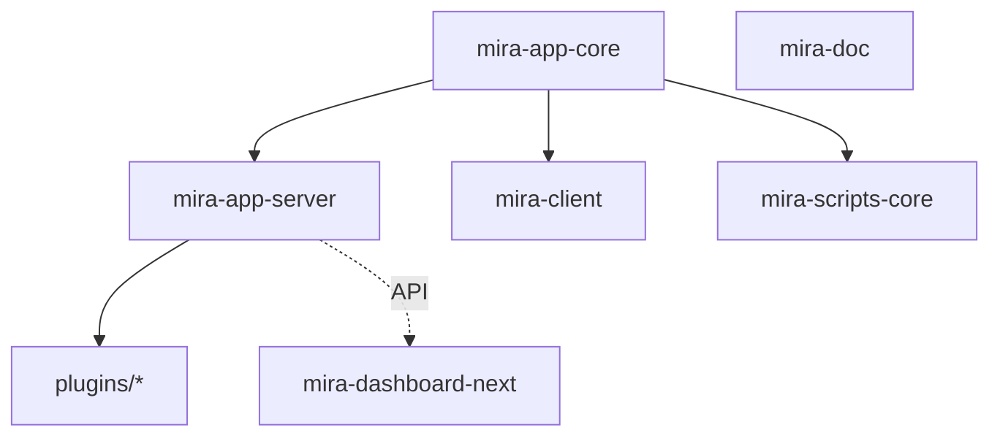

# 模块职责详情

> 本文件列出仓库内所有活跃模块的职责摘要。每个模块有独立的 `CLAUDE.md` + `claude/` 详情。

## 活跃包(packages/)

### mira-app-core (v2.0.1)

- 路径:`packages/mira-app-core`
- 语言:TypeScript
- 职责:核心库 —— 事件管理器(EventManager)、库列表管理、共享类型
- 子模块:
  - `src/storage/sqlite/`:SQLite 存储(ILibraryServerData / LibraryServerDataSQLite,文件/文件夹/标签 CRUD、事务、统计)
  - `src/shared/sdk/`:TypeScript SDK(MiraClient、HttpClient、WebSocketClient、10 个 API 模块)
- 入口:`src/index.ts`
- 测试:无

### mira-app-server (v2.0.1)

- 路径:`packages/mira-app-server`
- 语言:TypeScript
- 职责:独立服务端 —— Express HTTP + WebSocket,15 个路由模块,CLI,用户认证,内置 ThumbnailService / SettingsManager
- 入口:`src/index.ts` | CLI:`src/cli.ts`
- 测试:Jest(`sdk/` 目录)

### mira-client (v1.0.5)

- 路径:`packages/mira-client`
- 语言:TypeScript / Vue 3.5
- 职责:Electron 桌面客户端 —— 媒体浏览/预览/管理、插件系统、Tab 导航、11 个 Pinia Store
- 多窗口:`main`(主进程)、`renderer`(主 UI)、`preload`、`floating-window`、`notification-window`、`search-window`
- 入口:`src/main/main.ts`(主进程)、`src/renderer/`(渲染进程)
- UI 技术栈:Tailwind v4 + shadcn-vue(new-york,基于 reka-ui),34 个基础组件
- 测试:无独立测试,依赖 `pnpm run type-check`

### mira-dashboard-next (v0.0.0)

- 路径:`packages/mira-dashboard-next`
- 语言:TypeScript / Vue 3.5
- 职责:Web 管理面板 —— shadcn-vue 2.7 + Tailwind v4,功能页面 + 认证页,i18n 支持
- 入口:`src/main.ts`
- 测试:无

### mira-scripts-core (v1.0.5)

- 路径:`packages/mira-scripts-core`
- 语言:TypeScript
- 职责:脚本工具集 —— 数据转换(convertLibraryData)、文件导入(pathFilesToLibrary)
- 入口:`index.ts`
- 测试:无

### mira-doc (v1.0.0)

- 路径:`packages/mira-doc`
- 语言:Markdown / VitePress
- 职责:项目文档站 —— VitePress 2.0-alpha 驱动
- 入口:`.vitepress/`
- 测试:无

## 插件(plugins/)

| 插件 | 路径 | 职责 |
|------|------|------|
| mira_n8n | `plugins/plugins/mira_n8n` | n8n Webhook 集成,独立 WebSocket 服务器转发事件 |
| mira_thumb_imagemagick | `plugins/plugins/mira_thumb_imagemagick` | ImageMagick 缩略图生成(PSD/AI/EPS/SVG/TIFF/DNG/HEIC 等) |
| mira_duplicate_scanner | `plugins/plugins/mira_duplicate_scanner` | 重复文件扫描与删除;HTTP `POST /duplicate/scan`、`/duplicate/delete`;前端路由 `/tools/duplicate-scanner` |
| mira_thumb (旧) | `plugins/old_plugins/mira_thumb` | 旧版 ffmpeg 缩略图生成,位于 old_plugins/,可能已被服务端内置 ThumbnailService 取代 |

## 已移除/合并模块

| 模块 | 原路径 | 说明 |
|------|--------|------|
| mira-storage-sqlite | `packages/mira-storage-sqlite` | 已合并到 mira-app-core |
| mira-server-sdk | `packages/mira-server-sdk` | 已合并到 mira-app-core |
| mira-server-sdk-examples | `packages/mira-server-sdk-examples` | 已从 workspace 移除(workspace.yaml 仍有陈旧条目) |
| n8n-nodes-mira-ws-trigger | `packages/n8n-nodes-mira-ws-trigger` | 已从 workspace 移除(workspace.yaml 仍有陈旧条目) |
| mira-dashboard | `packages/mira-dashboard` | 已替换为 mira-dashboard-next |
| mira_user | `plugins/plugins/mira_user` | 源码移除,功能内置于服务端 |
| upload_statistics | `plugins/plugins/upload_statistics` | 源码移除,功能内置于服务端 |

## 模块关系图

