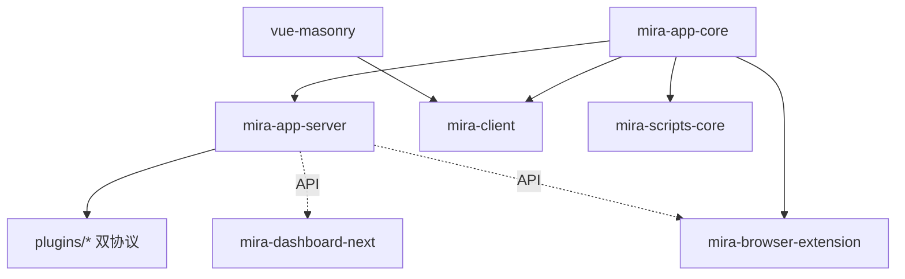

# 模块职责详情

> 本文件列出仓库内所有活跃模块的职责摘要。每个模块有独立的 `CLAUDE.md` + `claude/` 详情。

## 活跃包(packages/)

### mira-app-core (v2.0.3)

- 路径:`packages/mira-app-core`
- 语言:TypeScript
- 职责:核心库 —— 事件管理器(EventManager)、库列表管理、共享类型
- 子模块:
  - `src/storage/sqlite/`:SQLite 存储(ILibraryServerData / LibraryServerDataSQLite,文件/文件夹/标签 CRUD、事务、统计、MetadataImport)
  - `src/shared/sdk/`:TypeScript SDK(MiraClient、HttpClient、WebSocketClient、10 个 API 模块)
- 入口:`src/index.ts`
- 测试:`MetadataImport.test.ts`

### mira-app-server (v2.0.3)

- 路径:`packages/mira-app-server`
- 语言:TypeScript
- 职责:独立服务端 —— Express HTTP(19 路由)+ WebSocket、素材库管理、插件管理器(双协议)、用户认证、内置 ThumbnailService / SettingsManager
- 入口:`src/index.ts` | CLI:`src/cli.ts`
- 关键文件:`src/ServerPluginManager.ts`(同时实现 `ServerPlugin` 基类与 `FileFormatManager.registerFileFormat` 两套协议)
- 测试:Jest(`sdk/` 目录)

### mira-client (v1.0.5,mira-web)

- 路径:`packages/mira-client`
- 语言:TypeScript / Vue 3.5
- 职责:Electron 桌面客户端 —— 媒体浏览/预览/管理、插件系统、Tab 导航、Pinia Store
- 多窗口:`main`(主进程)、`renderer`(主 UI)、`preload`、`floating-window`、`notification-window`、`search-window`
- 入口:`src/main/main.ts`(主进程)、`src/renderer/`(渲染进程)
- UI 技术栈:Tailwind v4 + shadcn-vue(new-york,基于 reka-ui);**迁移已完成,合并到 main**
- 测试:无独立测试,依赖 `pnpm run type-check`

### mira-dashboard-next (v0.0.0)

- 路径:`packages/mira-dashboard-next`
- 语言:TypeScript / Vue 3.5
- 职责:Web 管理面板 —— shadcn-vue 2.7 + Tailwind v4,功能页面 + 认证页,i18n 支持
- 入口:`src/main.ts`
- 测试:无

### mira-browser-extension (v0.1.0)

- 路径:`packages/mira-browser-extension`
- 语言:TypeScript / Vue 3
- 职责:Chrome MV3 浏览器扩展 —— 网页素材采集(截图/拖拽/嗅探)、高清大图升级(maxurl)、认证上传
- 四上下文:Service Worker / Content Script / Offscreen Document / UI(popup+side panel)
- 入口:`src/background/index.ts`(Service Worker)、`src/manifest.ts`(MV3 manifest 生成)
- 测试:Vitest(42+ 用例,见 `*.test.ts`)

### vue-masonry (v0.1.0,@hunmer/vue-masonry)

- 路径:`packages/vue-masonry`
- 语言:TypeScript / Vue 3
- 职责:Vue 3 瀑布流组件 —— 响应式列数 / 跨列跨行 / 宽高比 / 懒加载 / 入场 & layout 动画 / 排序
- 入口:`src/index.ts`(导出 `Masonry.vue` + `LazyCell.vue` + `types` + `utils`)
- 被 mira-client 依赖
- 测试:无

### landing-page (v0.1.0,efferd-ui)

- 路径:`packages/landing-page`
- 语言:TypeScript / React 19 / Next.js 16
- 职责:Mira 官方落地页 / 营销站(独立技术栈,**与 Mira 主链路无运行时依赖**)
- 入口:`app/`(Next.js App Router)、`components/`(含 shadcn registry)
- 测试:无独立测试,含 lint/format

### mira-scripts-core (v1.0.5)

- 路径:`packages/mira-scripts-core`
- 语言:TypeScript
- 职责:脚本工具集 —— 数据转换(convertLibraryData)、文件导入(pathFilesToLibrary)
- 入口:`index.ts`
- 测试:无

### mira-doc (v1.0.0)

- 路径:`packages/mira-doc`
- 语言:Markdown / VitePress
- 职责:项目文档站 —— VitePress 驱动,含 install/快速开始等指南
- 入口:`.vitepress/config.mts`、`index.md`
- 测试:无

## 插件(plugins/)

> **双协议**:旧版 `extends ServerPlugin` 深度介入服务端;新版 `registerFileFormat(ServerFileFormatHandler)` 声明格式扩展与缩略图。注册表:`plugins/plugins/plugins.json`。

| 插件 | 版本 | 路径 | 协议 | 职责 |
|------|------|------|------|------|
| mira_n8n | v1.0.7 | `mira_n8n` | 旧 | n8n Webhook/WS 集成,独立 WS 转发文件事件(默认禁用) |
| mira_eagle_extension | v1.0.0 | `mira_eagle_extension` | 旧 | 复刻 Eagle 本地 HTTP 协议,让 Eagle 浏览器扩展无改接入(默认禁用) |
| mira_3d_format | v1.0.1 | `mira_3d_format` [+web] | 格式 | GLB/GLTF 解析 + GLB 缩略图(render-glb + @gltf-transform) |
| mira_spine_format | v1.1.0 | `mira_spine_format` [+web] | 格式 | Spine `.skel/.spine` 解析,idle-first 预览 |
| mira_epub_format | v1.0.0 | `mira_epub_format` [+web] | 格式 | EPUB 元数据 + 封面缩略图 + 阅读 |
| mira_livp_format | v1.0.0 | `mira_livp_format` [+web] | 格式 | LIVP Live Photo 缩略图与预览 |
| mira_lottie_format | v1.0.0 | `mira_lottie_format` [+web] | 格式 | dotLottie 缩略图与预览 |
| mira_pag_format | v1.0.0 | `mira_pag_format` [+web] | 格式 | PAG 格式缩略图与预览(需 `PAG_BROWSER_PATH` 指定 Chrome) |
| mira_swf_format | v1.0.0 | `mira_swf_format` [+web] | 格式 | SWF 元数据 + FFmpeg 缩略图 + Ruffle 预览 |
| mira_zipper_format | v1.0.0 | `mira_zipper_format` [+web] | 格式 | ZIP 归档只读浏览/预览 |
| pdf-viewer | v1.0.0 | `pdf-viewer` [+web] | 格式 | PDF 文档预览(浏览器内置 PDF 渲染) |
| psd-viewer | v1.0.0 | `psd-viewer` [+web] | 格式 | PSD/PSB 分层查看器(浏览器本地解析) |

`[+web]` = 含 `web/` 子目录(客户端动态加载的预览 UI,带 `plugin.json`)。

## 客户端在线插件(online_client_plugins/)

通过 `scripts/build-client-plugins-index.mjs` 生成索引,Electron 渲染进程动态加载。当前包含(部分):

- `mira-3d-format-preview`、`mira-spine-format-preview`、`mira-pinterest-search`、`mira-whiteboard`、`mira-custom-tab-demo`、`mira-welcome-demo`、`psd-viewer`

## 已移除/合并模块

| 模块 | 原路径 | 说明 |
|------|--------|------|
| mira-storage-sqlite | `packages/mira-storage-sqlite` | 已合并到 mira-app-core |
| mira-server-sdk | `packages/mira-server-sdk` | 已合并到 mira-app-core |
| mira-server-sdk-examples | `packages/mira-server-sdk-examples` | 已移除(2026-08-11 已从 workspace.yaml 清理) |
| n8n-nodes-mira-ws-trigger | `packages/n8n-nodes-mira-ws-trigger` | 已移除(2026-08-11 已从 workspace.yaml 清理;`dependency-switch-config-*.json` 仍残留悬空引用) |
| mira-dashboard | `packages/mira-dashboard` | 已替换为 mira-dashboard-next |
| mira_user | `plugins/plugins/mira_user` | 源码移除,功能内置于服务端 |
| upload_statistics | `plugins/plugins/upload_statistics` | 源码移除,功能内置于服务端 |
| mira_thumb_imagemagick | `plugins/plugins/mira_thumb_imagemagick` | 已移除(功能被格式插件体系与内置 ThumbnailService 取代) |
| mira_thumb (旧) | `plugins/old_plugins/mira_thumb` | 旧版 ffmpeg 缩略图,位于 old_plugins/ |

## 模块关系图

