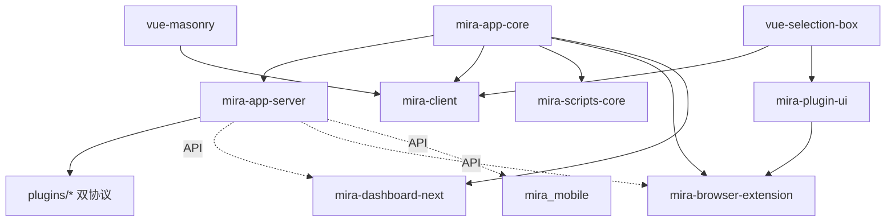

# 模块职责详情

> 本文件列出仓库内所有活跃模块的职责摘要。每个模块有独立的 `CLAUDE.md` + `claude/` 详情。

## 活跃包(packages/)

### mira-app-core (v2.0.8)

- 路径:`packages/mira-app-core`
- 语言:TypeScript
- 职责:核心库 —— 事件管理器(EventManager)、库列表管理、共享类型
- 子模块:
  - `src/storage/sqlite/`:SQLite 存储(ILibraryServerData / LibraryServerDataSQLite,文件/文件夹/标签 CRUD、事务、统计、MetadataImport)
  - `src/shared/sdk/`:TypeScript SDK(MiraClient、HttpClient、WebSocketClient、17 个 API 模块,含 CookieSite/Settings/Admin/Download/FileSystem/Statistics/Thumbnail)
- 入口:`src/index.ts`
- 测试:vitest(27 个测试文件 + test-helpers)

### mira-app-server (v2.0.9)

- 路径:`packages/mira-app-server`
- 语言:TypeScript
- 职责:独立服务端 —— Express HTTP(19 路由)+ WebSocket、素材库管理、插件管理器(双协议)、用户认证、内置 ThumbnailService / SettingsManager、MCP 服务(`--mcp` stdio)、数据同步(`src/sync/`)
- 入口:`src/index.ts` | CLI:`src/cli.ts` + `src/cli/commands/`(顶层 5 命令 + 11 个域子命令 + doctor)
- 关键文件:`src/ServerPluginManager.ts`(同时实现 `ServerPlugin` 基类与 `FileFormatManager.registerFileFormat` 两套协议)
- 测试:Jest(`sdk/` 目录)

### mira-client (v2.0.9,mira-web)

- 路径:`packages/mira-client`
- 语言:TypeScript / Vue 3.5
- 职责:Electron 桌面客户端 —— 媒体浏览/预览/管理、插件系统、Tab 导航、Pinia Store(15 个)、i18n(vue-i18n 11,zh-CN/en-US)
- 多窗口:`main`(主进程)、`renderer`(主 UI)、`preload`、`floating-ball-window`(悬浮球)、`notification-window`、`search-window`
- 入口:`src/main/main.ts`(主进程)、`src/renderer/`(渲染进程)
- UI 技术栈:Tailwind v4 + shadcn-vue(new-york,基于 reka-ui,52 组件);**迁移已完成,合并到 main**
- 测试:`procm-ui-tests/`(约 30 个 UI 用例,`pnpm run test:ui:remote`)+ `DownloadService.test.ts`;门禁 `pnpm run type-check`

### mira_mobile (v1.0.0+1)

- 路径:`packages/mira_mobile`
- 语言:Dart / Flutter(^3.10.0)
- 职责:移动端 —— 素材浏览/搜索/文件下载(含通知)、相册自动备份(photo_manager)、easy_localization 双语、主题/背景个性化
- 结构:`lib/` 92 文件(screens 24、providers 14、services 6、widgets/glass 组件库);路由 17 条
- 入口:`lib/main.dart`
- 测试:9 个 dart 测试文件(providers/services/utils;screens 零覆盖)

### mira-plugin-ui (v1.1.0)

- 路径:`packages/mira-plugin-ui`
- 语言:TypeScript / Vue 3
- 职责:插件共享 UI 组件库 —— 自包含 dist(es+umd+单 CSS,仅 vue external),可经 CDN 引入;BatchUpload/SaveLocation/FileInfo 表单 + library 子入口(LibraryTree 等) + shadcn 13 族
- 消费方:mira-browser-extension(`workspace:*`)、plugins/mira_tiptap_format/web(`file:`)
- 入口:`src/index.ts` | 构建:`pnpm --filter mira-plugin-ui build`(vite 库模式)
- 测试:无(提供 demo 手动验证)

### mira-dashboard-next (v0.0.0)

- 路径:`packages/mira-dashboard-next`
- 语言:TypeScript / Vue 3.5
- 职责:Web 管理面板 —— shadcn-vue 2.7 + Tailwind v4,功能页面 + 认证页,i18n 支持;API 层已迁移到 mira-app-core SDK(`src/lib/miraClient.ts`,12/13 模块)
- 入口:`src/main.ts`
- 测试:无

### mira-browser-extension (v0.1.0)

- 路径:`packages/mira-browser-extension`
- 语言:TypeScript / Vue 3
- 职责:Chrome MV3 浏览器扩展 —— 网页素材采集(截图/拖拽/嗅探/悬停按钮/网页内批量导入)、cookie/DNR 资源抓取、批量上传独立窗口(IndexedDB 暂存)、多服务器管理、高清大图升级(maxurl)
- 四上下文:Service Worker / Content Script / Offscreen Document / UI(popup+side panel+upload)
- 入口:`src/background/index.ts`(Service Worker)、`src/manifest.ts`(MV3 manifest 生成)
- 依赖 mira-plugin-ui(library 子入口);vite 需 vue 单路径 alias 防双实例
- 测试:Vitest(19 个测试文件,约 137 用例)

### vue-masonry (v0.1.0,@hunmer/vue-masonry)

- 路径:`packages/vue-masonry`
- 语言:TypeScript / Vue 3
- 职责:Vue 3 瀑布流组件 —— 响应式列数 / 跨列跨行 / 宽高比 / 懒加载 / 入场 & layout 动画 / 排序
- 入口:`src/index.ts`(导出 `Masonry.vue` + `LazyCell.vue` + `types` + `utils`)
- 被 mira-client、mira-browser-extension(嗅探瀑布流)依赖
- 测试:无

### vue-selection-box (v0.1.0,@hunmer/vue-selection-box)

- 路径:`packages/vue-selection-box`
- 语言:TypeScript / Vue 3
- 职责:Vue 3 框选组件 —— 拖拽矩形框选 / Alt 减选 / Shift 范围选 / Ctrl 加选 / 边缘自动滚动 / 快捷键,`data-selectable-id` 协议零侵入
- 入口:`src/index.ts`(导出 `SelectionBox.vue` + types;src 仅 3 文件)
- 被 mira-client(6 个组件)、mira-plugin-ui 依赖
- 测试:无(`type-check` 门禁)

### landing-page (v0.1.0,efferd-ui)

- 路径:`packages/landing-page`
- 语言:TypeScript / React 19.2 / Next.js 16.0.7
- 职责:Mira 官方落地页 efferd.com —— 单页营销站(9 个 section:Hero/PhoneMockup/DesktopPreview/Feature/LogoCloud/Testimonials/FAQs/Contact/Footer);静态导出(`output: "export"` + basePath `/introduction`,postbuild 改名)
- 入口:`app/`(Next.js App Router)、`components/`(含 kibo-ui、media-waterfall 等)
- shadcn registry 构建链已移除;新增 three / next-themes / @next/third-parties(GA)
- 测试:无独立测试,含 lint/format

### mira-scripts-core (v1.0.5)

- 路径:`packages/mira-scripts-core`
- 语言:TypeScript
- 职责:脚本工具集 —— 数据转换(convertLibraryData)、文件导入(pathFilesToLibrary)
- 入口:`index.ts`
- 测试:无

### mira-doc (v1.0.0)

- 路径:`packages/mira-doc`
- 语言:Markdown / VitePress
- 职责:项目文档站 —— VitePress 驱动,含 install/快速开始/cli/mcp/skill 指南;部署 base 已改为 `/docs/`
- 入口:`.vitepress/config.mts`、`index.md`
- 测试:无

## 插件(plugins/)

> **双协议**:旧版 `extends ServerPlugin` 深度介入服务端;新版 `registerFileFormat(ServerFileFormatHandler)` 声明格式扩展与缩略图。共 **14 个**(旧协议 3 + 格式协议 11)。推荐注册表:`plugins/plugins/plugins.recommend.json`;服务端运行时注册表:`packages/mira-app-server/src/plugins/plugins.json`。

| 插件 | 版本 | 路径 | 协议 | 职责 |
|------|------|------|------|------|
| mira_n8n | v1.0.7 | `mira_n8n` | 旧 | n8n Webhook/WS 集成,独立 WS 转发文件事件(默认禁用) |
| mira_eagle_extension | v1.0.0 | `mira_eagle_extension` | 旧 | 复刻 Eagle 本地 HTTP 协议,让 Eagle 浏览器扩展无改接入(默认禁用) |
| mira_gallery_dl | v1.0.x | `mira_gallery_dl` | 旧 | gallery-dl 站点下载集成(自定义类 + `getRoutes()`/`registerRounter`) |
| mira_3d_format | v1.0.2 | `mira_3d_format` [+web] | 格式 | GLB/GLTF 解析 + GLB 缩略图(render-glb + @gltf-transform) |
| mira_spine_format | v1.1.1 | `mira_spine_format` [+web] | 格式 | Spine `.skel/.spine` 解析,idle-first 预览 |
| mira_epub_format | v1.0.0 | `mira_epub_format` [+web] | 格式 | EPUB 元数据 + 封面缩略图 + 阅读 |
| mira_livp_format | v1.0.0 | `mira_livp_format` [+web] | 格式 | LIVP Live Photo 缩略图与预览 |
| mira_lottie_format | v1.0.0 | `mira_lottie_format` [+web] | 格式 | dotLottie 缩略图与预览 |
| mira_pag_format | v1.0.0 | `mira_pag_format` [+web] | 格式 | PAG 格式缩略图与预览(需 `PAG_BROWSER_PATH` 指定 Chrome) |
| mira_swf_format | v1.0.0 | `mira_swf_format` [+web] | 格式 | SWF 元数据 + FFmpeg 缩略图 + Ruffle 预览 |
| mira_tiptap_format | v1.0.x | `mira_tiptap_format` [+web] | 格式 | `.tiptap` 富文本(Tiptap Notion 风格编辑器,85 文件 web 端,防抖自动保存) |
| mira_zipper_format | v1.0.0 | `mira_zipper_format` [+web] | 格式 | ZIP 归档只读浏览/预览 |
| pdf-viewer | v1.0.0 | `pdf-viewer` [+web] | 格式 | PDF 文档预览(浏览器内置 PDF 渲染) |
| psd-viewer | v1.0.1 | `psd-viewer` [+web] | 格式 | PSD/PSB 分层查看器(浏览器本地解析) |

`[+web]` = 含 `web/` 子目录(客户端动态加载的预览 UI,带 `plugin.json`)。

## 客户端在线插件(online_client_plugins/)

通过 `scripts/build-client-plugins-index.mjs` 生成索引,Electron 渲染进程动态加载。当前包含(部分):

- `mira-3d-format-preview`、`mira-spine-format-preview`、`mira-pinterest-search`、`mira-whiteboard`、`mira-custom-tab-demo`、`mira-welcome-demo`、`psd-viewer`

## 已移除/合并模块

| 模块 | 原路径 | 说明 |
|------|--------|------|
| mira-storage-sqlite | `packages/mira-storage-sqlite` | 已合并到 mira-app-core |
| mira-server-sdk | `packages/mira-server-sdk` | 已合并到 mira-app-core |
| mira-server-sdk-examples | `packages/mira-server-sdk-examples` | 已移除(2026-08-11 已从 workspace.yaml 清理) |
| n8n-nodes-mira-ws-trigger | `packages/n8n-nodes-mira-ws-trigger` | 已移除(2026-08-11 已从 workspace.yaml 清理;`dependency-switch-config-*.json` 仍残留悬空引用) |
| mira-dashboard | `packages/mira-dashboard` | 已替换为 mira-dashboard-next |
| mira_user | `plugins/plugins/mira_user` | 源码移除,功能内置于服务端 |
| upload_statistics | `plugins/plugins/upload_statistics` | 源码移除,功能内置于服务端 |
| mira_thumb_imagemagick | `plugins/plugins/mira_thumb_imagemagick` | 已移除(功能被格式插件体系与内置 ThumbnailService 取代) |
| mira_duplicate_scanner | `plugins/plugins/mira_duplicate_scanner` | 已移除(2026-08-13,磁盘无此目录) |
| mira_thumb (旧) | `plugins/old_plugins/mira_thumb` | 旧版 ffmpeg 缩略图,位于 old_plugins/ |

## 模块关系图

