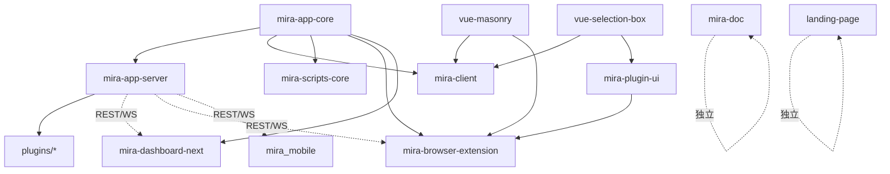

# 项目总览

## 项目愿景

Mira TypeScript 是一个基于 TypeScript 的 monorepo 项目,目标是构建一个**新时代的素材管理软件**。核心能力:

- 媒体文件的组织、检索、预览与管理(图片、视频、音频、文档、3D、动画、矢量、电子书等)
- 多素材库(Library)支持,每个库拥有独立的 SQLite 数据库
- 双协议插件架构:旧版 `ServerPlugin` 基类 + 新版 `registerFileFormat` 格式注册
- 实时 WebSocket 双向通信
- Web 后台管理面板
- n8n 自动化集成
- 跨平台桌面客户端(Electron)
- Chrome 浏览器扩展(网页素材采集入口)
- Next.js 官方落地页

## 架构分层

pnpm workspace monorepo,分为以下层次:

- **核心层** `mira-app-core`(v2.0.8):事件管理、库列表管理、SQLite 存储实现、TypeScript SDK(17 模块)、共享类型
- **服务层** `mira-app-server`(v2.0.9):HTTP REST API(19 路由)+ WebSocket、素材库管理、插件管理器(双协议)、用户认证、内置 ThumbnailService / SettingsManager、MCP 服务、多命令 CLI
- **客户端层** `mira-client`(v2.0.9,mira-web):Electron 38 + Vue 3.5 桌面客户端,shadcn-vue(52 组件)、i18n、悬浮球窗口
- **管理面板** `mira-dashboard-next`(v0.0.0):Vue 3.5 + shadcn-vue 2.7 + Tailwind v4 Web 后台,API 层走 mira-app-core SDK
- **浏览器扩展** `mira-browser-extension`(v0.1.0):Chrome MV3 网页素材采集(截图/拖拽/嗅探/批量上传/cookie 抓取)
- **移动端** `mira_mobile`(v1.0.0+1):Flutter(Dart ^3.10),浏览/下载/相册自动备份(不在 workspace.yaml,独立管理)
- **插件 UI 库** `mira-plugin-ui`(v1.1.0):自包含 dist 的共享组件库(ui 67 目录 + library 媒体库组件族),被扩展/CEP 面板/服务端插件 web/客户端市场插件共 8 处消费
- **栅格布局** `grid-layout-plus`(v2.0.0-beta.0):vendored fork,供 mira-client Home 仪表盘
- **CEP 面板** `mira-cep-panel`(v0.1.0):Photoshop 2020 内浏览/置入 Mira 素材(Chromium 61 兼容)
- **瀑布流组件** `vue-masonry`(v0.1.0,@hunmer/vue-masonry):Vue 3 瀑布流,被 mira-client/扩展依赖
- **框选组件** `vue-selection-box`(v0.1.0,@hunmer/vue-selection-box):Vue 3 框选,被 mira-client/mira-plugin-ui 依赖
- **落地页** `landing-page`(v0.1.0,efferd-ui):Next.js 16 + React 19 单页营销站(efferd.com,静态导出)
- **工具** `mira-scripts-core`(v1.0.5):数据迁移/导入 CLI
- **文档** `mira-doc`(v1.0.0):VitePress 文档站
- **插件** `plugins/`:服务端插件集合(16 个,见 [module-index.md](module-index.md))
- **客户端插件市场** `online_client_plugins/`(8 个入索引):视频剪辑器/格式预览/以图搜图/白板等,经 `plugins.json` 索引分发

## 技术栈

| 层次 | 技术 |
|------|------|
| 语言 | TypeScript(strict mode);移动端 Dart |
| 服务端 | Express 4 + ws/socket.io + SQLite3 + fluent-ffmpeg + MCP SDK |
| 客户端 | Electron 38 + Vue 3.5 + Pinia 3 + Tailwind v4 + shadcn-vue(reka-ui) |
| 管理面板 | Vue 3.5 + shadcn-vue 2.7 + Tailwind CSS 4 |
| 浏览器扩展 | Chrome MV3 + Vue 3 + @crxjs/vite-plugin + mira-plugin-ui |
| 移动端 | Flutter + provider + easy_localization |
| 落地页 | Next.js 16 + React 19 + three |
| 构建 | Vite 6 + TypeScript 5.7 |
| 文档 | VitePress |
| 包管理 | pnpm workspace(无 turbo/nx/lerna) |

## 模块依赖关系

## 工作区配置注意

`pnpm-workspace.yaml` 当前显式声明 9 个包 + 2 个 glob(`online_client_plugins/plugins/*`、`plugins/plugins/*/web`)。其中:

- 2026-08-11 已清理陈旧条目 `mira-server-sdk-examples`、`n8n-nodes-mira-ws-trigger`;2026-08-20 前已补入 `mira-plugin-ui`、`vue-selection-box`
- `packages/landing-page`(efferd-ui)与 `packages/mira_mobile`(Flutter)未在 workspace.yaml 声明,独立管理
- `dependency-switch-config-{macos,windows}.json` 与 `tool.js` 已从仓库移除(2026-08-20 核实,无残留引用)
