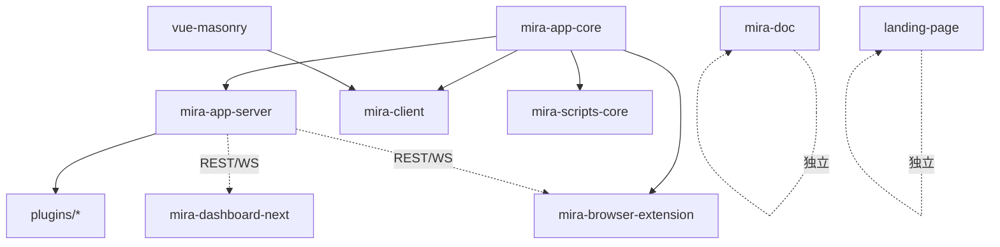

# 项目总览

## 项目愿景

Mira TypeScript 是一个基于 TypeScript 的 monorepo 项目,目标是构建一个**新时代的素材管理软件**。核心能力:

- 媒体文件的组织、检索、预览与管理(图片、视频、音频、文档、3D、动画、矢量、电子书等)
- 多素材库(Library)支持,每个库拥有独立的 SQLite 数据库
- 双协议插件架构:旧版 `ServerPlugin` 基类 + 新版 `registerFileFormat` 格式注册
- 实时 WebSocket 双向通信
- Web 后台管理面板
- n8n 自动化集成
- 跨平台桌面客户端(Electron)
- Chrome 浏览器扩展(网页素材采集入口)
- Next.js 官方落地页

## 架构分层

pnpm workspace monorepo,分为以下层次:

- **核心层** `mira-app-core`(v2.0.3):事件管理、库列表管理、SQLite 存储实现、TypeScript SDK、共享类型
- **服务层** `mira-app-server`(v2.0.3):HTTP REST API(19 路由)+ WebSocket、素材库管理、插件管理器(双协议)、用户认证、内置 ThumbnailService / SettingsManager
- **客户端层** `mira-client`(v1.0.5,mira-web):Electron 38 + Vue 3.5 桌面客户端,shadcn-vue 迁移已完成
- **管理面板** `mira-dashboard-next`(v0.0.0):Vue 3.5 + shadcn-vue 2.7 + Tailwind v4 Web 后台
- **浏览器扩展** `mira-browser-extension`(v0.1.0):Chrome MV3 网页素材采集(截图/拖拽/嗅探)
- **瀑布流组件** `vue-masonry`(v0.1.0,@hunmer/vue-masonry):Vue 3 瀑布流,被 mira-client 依赖
- **落地页** `landing-page`(v0.1.0,efferd-ui):Next.js 16 + React 19 + shadcn 官方站
- **工具** `mira-scripts-core`(v1.0.5):数据迁移/导入 CLI
- **文档** `mira-doc`(v1.0.0):VitePress 文档站
- **插件** `plugins/`:服务端插件集合(13 个,见 [module-index.md](module-index.md))

## 技术栈

| 层次 | 技术 |
|------|------|
| 语言 | TypeScript(strict mode) |
| 服务端 | Express 4 + ws/socket.io + SQLite3 + fluent-ffmpeg |
| 客户端 | Electron 38 + Vue 3.5 + Pinia 3 + Tailwind v4 + shadcn-vue(reka-ui) |
| 管理面板 | Vue 3.5 + shadcn-vue 2.7 + Tailwind CSS 4 |
| 浏览器扩展 | Chrome MV3 + Vue 3 + @crxjs/vite-plugin |
| 落地页 | Next.js 16 + React 19 + shadcn |
| 构建 | Vite 6 + TypeScript 5.7 |
| 文档 | VitePress |
| 包管理 | pnpm workspace(无 turbo/nx/lerna) |

## 模块依赖关系

## 工作区配置注意

`pnpm-workspace.yaml` 当前显式声明 7 个包 + 2 个 glob(`online_client_plugins/plugins/*`、`plugins/plugins/*/web`)。其中:

- 2026-08-11 已清理陈旧条目 `mira-server-sdk-examples`、`n8n-nodes-mira-ws-trigger`
- `packages/landing-page`(efferd-ui)未在 workspace.yaml 显式声明,使用独立 `pnpm-lock.yaml` 管理
- `dependency-switch-config-{macos,windows}.json` 中**仍残留** `n8n-nodes-mira-ws-trigger` 的悬空 `file:` 引用(磁盘不存在),仅被 `tool.js` 辅助脚本消费,不影响 pnpm install;建议后续一并清理
