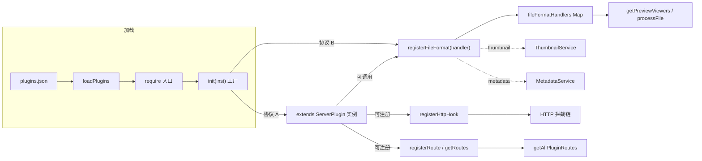

# 插件系统与双协议调度

> 基于 `src/ServerPluginManager.ts`(2026-08-20 确认 660 行;2026-08-11 全量深扫时为 576 行)与 `src/ServerPlugin.ts`(124 行)深扫。本文聚焦**调度机制**,插件清单见仓库根 `claude/module-index.md` 与 `plugins/CLAUDE.md`。双协议(ServerPlugin / registerFileFormat)调度机制在 2026-08-20 增量核对中未发现变化,协议记载仍然准确。

## 总览

`ServerPluginManager` 是**per-library**(每个素材库一个实例)的插件管理器。一个实例同时承载两套并行协议:

## 构造与初始化

`constructor({ server, dbService, pluginsDir })`:

1. `pluginsDir = path.join(pluginsDir ?? __dirname, 'plugins')` — 默认 `src/plugins/`(构建后 `dist/plugins/`)
2. `pluginsConfigPath = pluginsDir/plugins.json`
3. 创建 `MiraClient`(指向本服务 `httpPort`,默认 8081)供插件调用后端 API
4. 若 `plugins/` 目录或 `plugins.json` 不存在则自动创建(空数组)
5. 注入 `server: MiraWebsocketServer`、`dbService: ILibraryServerData`

> 关键:`MiraClient` 是**预创建的 HTTP 客户端**,所有插件共享同一实例(指向本机后端),用于"插件回调服务端 API"场景。

## 核心数据结构

| 字段 | 类型 | 用途 |
|------|------|------|
| `loadedPlugins` | `Map<string, any>` | 已加载插件实例(协议 A 的返回值 / 协议 B 的任意返回) |
| `httpHooks` | `HttpHookDefinition[]` | HTTP 拦截链(协议 A 注册) |
| `fileFormatHandlers` | `Map<string, { pluginName, handler }>` | 格式处理器,key = `${pluginName}:${handler.id}` |
| `fields` | `Record<string, any>[]` | 自定义字段注册(扩展文件元数据 schema) |
| `miraClient` | `MiraClient` | 注入给插件的 SDK 实例 |

## 协议 A — `extends ServerPlugin`(深度插件)

### 加载流程

`loadPlugin(pluginConfig)` → `require(pluginPath)` → `init({ pluginManager, server, dbService, miraClient })` → 返回值存入 `loadedPlugins`。

注入对象 `inst` 字段:
- `pluginManager: this` — 用于回调 `registerHttpHook` / `registerFileFormat` / `registerField` 等
- `server: MiraWebsocketServer` — 直接访问 WS 后端
- `dbService: ILibraryServerData` — 直接访问 SQLite
- `miraClient: MiraClient` — HTTP SDK 调后端 API

### 能力点

| 方法 | 触发方 | 用途 |
|------|--------|------|
| `pluginManager.registerHttpHook({ method?, path\|RegExp, handler })` | 协议 A | 拦截 HTTP 请求;handler 返回 `false` 阻断(见下) |
| `pluginManager.registerField(field)` / `registerFields` | 协议 A | 扩展文件元数据字段 |
| `plugin.getRoutes()` / `pluginManager.getAllPluginRoutes()` | 协议 A | 暴露自定义前端路由(被 `HttpRouter` 消费) |
| `plugin.cleanup()` | 协议 A(可选) | 卸载时回调清理 |

### HTTP Hook 调度

`runHttpHooks(context): Promise<boolean>`:

1. 遍历 `httpHooks`,`matchesHttpHook` 判定:`method`(大写比较)+ `path`(字符串全等 或 RegExp test)
2. 调用 `await hook.handler(context)`,**任一返回 `false` 立即短路**(返回 `false` 表示拦截)
3. 全部通过返回 `true`

`HttpHookContext` 字段:`{ libraryId, clientId?, method, path, req, res, fields? }`。

> 调用方:HTTP 中间件链(在路由分发前),负责权限/拦截/字段预处理。具体调用点在 `HttpServer.ts` 路由注册处(本扫描未覆盖,见下"缺口")。

### 路由暴露

`getAllPluginRoutes()` 遍历所有 `loadedPlugins`,对实现了 `getRoutes()` 方法的实例收集 `PluginRouteDefinition[]`,每条附加 `pluginName` 字段。返回值被 `HttpRouter.ts`(`src/routes/HttpRouter.ts`,43K)消费,挂载为动态路由。

## 协议 B — `registerFileFormat`(格式插件)

### 注册调度(`registerFileFormat(pluginName, handler)`)

1. **校验**:`handler.id` 必填;`extensions[]` 与 `mimeTypes[]` 至少一个非空
2. **key 唯一化**:`${pluginName}:${handler.id}`
3. **重注册清理**:若该 key 已存在且旧 handler 有 `thumbnail`/`metadata`,先从 `ThumbnailService` / `MetadataService` 反注册(`unregisterGenerator(key)` / `unregisterRule(key)`)
4. **写入** `fileFormatHandlers` Map
5. **联动 ThumbnailService**:若 `handler.thumbnail` 存在,构造 `ThumbnailGenerator`(`name=key`、`supportedExtensions = thumbnailExtensions ?? extensions` 去点小写、`generate = handler.thumbnail`)并 `registerGenerator`
6. **联动 MetadataService**:若 `handler.metadata` 存在,构造 `MetadataRule`(`name=key`、`supportedExtensions`、`parse = handler.metadata`)并 `registerRule`
7. 返回**反注册句柄** `() => unregisterFileFormat(pluginName, id)`

> 关键设计:**格式插件不直接调 ThumbnailService**,而是声明 `thumbnail(srcPath, destPath)`,由管理器桥接到 `ThumbnailService`。`thumbnailExtensions` 缺省回落到 `extensions`,允许"识别某格式但不生成缩略图"或"只为子集生成缩略图"。

### `ServerFileFormatHandler` 字段

| 字段 | 类型 | 说明 |
|------|------|------|
| `id` | string | 唯一 id(必填) |
| `extensions` | string[] | 文件扩展名(无点小写) |
| `mimeTypes` | string[] | MIME 类型 |
| `thumbnailExtensions` | string[] | 生成缩略图的扩展名子集(默认=extensions) |
| `thumbnail(src, dest)` | `Promise<void>` | 缩略图生成函数 |
| `process(filePath, ctx)` | `any\|Promise<any>` | 自定义元数据处理(被 `processFile` 调用) |
| `metadata` | `MetadataRule['parse']` | 元数据解析规则(联动 MetadataService) |
| `getExtraFileList(filePath, ctx)` | `string[]` | 声明附加文件列表(如 .psb 各图层) |
| `getExtraFile(filePath, fileName, ctx)` | `string` | 取单个附加文件 |
| `viewers[]` | `ServerPreviewViewerDefinition[]` | 预览查看器声明(见下) |

### Viewer 调度(`getPreviewViewers(context)`)

这是**协议 B 与客户端 Web 插件的桥梁**:

1. 取目标文件的 `extension` / `mimeType`
2. 读取 `getLoadedWebPlugins()` 的 manifest(来自各插件 `web/plugin.json`)
3. 遍历 `fileFormatHandlers`,**双层匹配**:
   - handler 层:`extensions` 或 `mimeTypes` 命中
   - viewer 层:viewer 自身的 `extensions`/`mimeTypes` 命中(空 = 全匹配)
4. **路径安全校验**:`viewer.entry` 必须解析到 `getPluginWebDir(pluginName)` 之内(`path.relative` 不以 `..` 开头、非绝对、文件存在),否则跳过并 warn
5. 调 `viewer.getQuery?.(context)` 生成查询参数
6. 生成 **iframeUrl**:`/server-plugins/{libraryId}/{pluginName}/{encodedEntry}[?{query}]`
7. 按 `priority`(默认取 manifest.priority)降序、`title` 字典序排序

> 客户端拿到 `ResolvedPreviewViewer[]` 后,用 `iframeUrl` 嵌入 iframe 加载预览。`/server-plugins/` 静态服务由 `HttpRouter.ts` 提供。

### `processFile` / `getExtraFileList` / `getExtraFile`

- `processFile(filePath, ctx)`:按扩展名/mime 找第一个匹配 handler,调其 `process`。无匹配返回 `undefined`
- `getExtraFileList` / `getExtraFile`:通过 `getFileFormatHandler` 取 handler 再调用(用于多文件格式,如 .psb 的图层、.zip 的内部文件)

## Web 插件 manifest(`getLoadedWebPlugins`)

遍历 `loadedPlugins` 的 key,读取每个 `web/plugin.json`,校验:

- `pluginId`、`pluginName` 必填
- `index`(默认 `index.js`)解析后**不能逃逸 web 目录**(`..` / 绝对路径 / 不存在 → skip)
- 附加 `serverPluginName = pluginName`(桥接 server plugin 名)

返回 `ServerWebPluginManifest[]`(`{ pluginName, pluginId, version, index, serverPluginName, ... }`)。

> 含义:**一个插件同时是 server 插件(协议 A 或 B)+ 客户端 web 插件**。Web 部分由客户端通过 manifest 动态加载,server 部分由本管理器加载。

## 插件列表元数据(`getPluginsList`)

读取 `plugins.json`,对每条:
- 读 `{pluginDir}/package.json`
- 探测图标文件(`icon.{png,jpg,jpeg,svg,ico}`),生成 `/api/plugins/{name}/icon{ext}`
- 解析 `package.json.mira.{title,icon,category,tags}` 字段(展示元数据)
- 返回 `{ name, enabled, path, status, configurable, icon, title, category, tags, ...packageInfo }`

## 生命周期

### 加载 `loadPlugins(reload=false)`

读 `plugins.json`,对每条 `enabled: true` 的调 `loadPlugin`。

### 单插件加载 `loadPlugin(config, reload)`

1. 已加载且非 reload → skip
2. reload 或已加载 → `delete require.cache[require.resolve(pluginPath)]`(热重载)
3. `require(pluginPath)` → 调 `init({ pluginManager, server, dbService, miraClient })`
4. 失败 → 从 `loadedPlugins` 删除并记 error

### 卸载 `unloadPlugin(name)`

1. 调 `plugin.cleanup?.()`(若实现)
2. **遍历 `fileFormatHandlers`,反注册所有该 pluginName 的格式**(从 ThumbnailService / MetadataService 也一并移除)
3. 从 `loadedPlugins` 删除

### 热重载 `reloadPlugin(name)`

`unloadPlugin(name)` → 读配置确认 `enabled` → `loadPlugin(config, reload=true)`。

### 增删 `addPlugin(config)`

更新 `plugins.json`(存在则覆盖),若 `enabled` 立即 `loadPlugin(config, reload=true)`。

## 启动时序(结合 MiraServer)

按 `MiraServer.start()`(见 `module-responsibilities.md`):SettingsManager → ThumbnailService → MiraHttpServer → MiraWebsocketServer → 接入缩略图广播 → LibraryStorage → ServerPluginManager。

> **per-library**:`ServerPluginManager` 实例与素材库绑定,每个库独立加载插件。`init(inst)` 对同一插件会被**每个库各调用一次**(见 `mira_eagle_extension/index.ts` 注释)。

## 缺口(待补)

- **`runHttpHooks` 调用点**:本扫描未覆盖 `HttpServer.ts` 路由注册处。需确认 HTTP Hook 在中间件链中的确切位置(权限校验前/后)。
- **`ServerPlugin` 基类**:本扫描未读 `src/ServerPlugin.ts` 全文,`registerRoute` / `writeConfig` / `readConfig` / `getRoutes` 的具体实现待补。
- **`ThumbnailService` 与 `MetadataService` 的 `register*`/`unregister*` 细节**:见 `src/services/`,本扫描未展开。
- **`/server-plugins/` 静态服务实现**:在 `HttpRouter.ts`(43K)中,未深扫。
- **`processFile` 调用链**:谁在何时调用 `processFile` / `getExtraFileList` / `getExtraFile` 需追踪到 `FileRoutes.ts` 或 handler。
