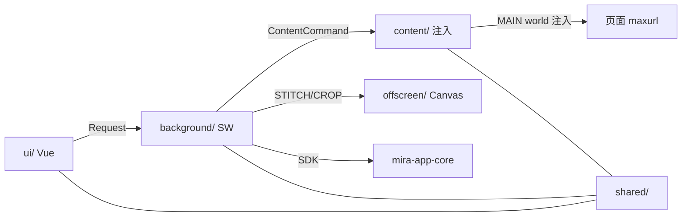

# 模块职责

四个运行时上下文 + 一个共享层。源码按 `src/<context>/` 组织。

## background/ — Service Worker(无 DOM)

| 文件 | 职责 |
|------|------|
| `index.ts` | SW 入口:装配 uploader/capturer/router,监听 onMessage/commands/tabs.onRemoved/onSettingsChange/onInstalled,维护 `sniffSnapshots` Map |
| `message-router.ts` | Request 分发中心:认证/配置/库/文件夹/上传/截图/嗅探/滚动的 case 路由;广播 Event |
| `mira-client.ts` | SDK 封装:`ensureClient`/`login`/`autoRelogin`/`withAuth`(401 自动重登一次);token 同步缓存(`cachedToken`) |
| `uploader.ts` | 上传队列:`createUploader`,并发控制、重试、进度通知、成功 TTL 移除、取消 |
| `capturer.ts` | 截图编排:可视/整页/选区;调 offscreen 拼接裁剪;产 File 入 uploader 队列 |
| `offscreen.ts` | offscreen document 生命周期:`ensureOffscreen`(reason=BLOBS)/`stitchFrames`/`cropImage` |
| `settings.ts` | 设置读写:`getSettings`/`updateSettings`/`onSettingsChange`/`initSettingsWatcher`(绑 storage.onChanged 广播) |
| `inject.ts` | content script 注入兜底:`sendToContent`(失败时 scripting.executeScript 重新注入,文件名从 manifest 动态读) |
| `context-menus.ts` | 右键菜单:截图三件套 + 图片「收藏到素材库」+ 扩展图标右键截图入口 |

## content/ — 注入网页(有 DOM)

| 文件 | 职责 |
|------|------|
| `index.ts` | content 入口:装配 sniffer/dragdrop/scroller;onMessage 处理 ContentCommand + 截图滚动命令;初始化读设置恢复开关;IMU 升级后的 URL 上传 |
| `sniffer.ts` | 资源嗅探:`extractFromDOM`(img/video/audio/background)、`createSniffer`(DOM 扫描 + PerformanceObserver + MutationObserver)、去重/合并 |
| `dragdrop.ts` | 拖拽浮层:dragstart 弹「不设文件夹 + 文件夹列表」浮层,自动滚动,落到文件夹带 folderId 上传 |
| `autoscroll.ts` | 自动滚动器:`createAutoScroller`,最大 50 帧,用于整页截图逐帧 |
| `overlay/selection.ts` | 选区截图遮罩:`drawSelection`,全屏遮罩 + 拖拽框选,返回 rect |

## offscreen/ — Offscreen Document(有 Canvas)

| 文件 | 职责 |
|------|------|
| `index.html` | offscreen 页面(挂 `index.ts`) |
| `index.ts` | 监听 STITCH/CROP 消息,调 image-ops |
| `image-ops.ts` | 纯 Canvas 逻辑:`stitch`(多帧拼接)、`crop`(裁剪)、`computeStitchSize`/`scaleRect`(可测纯函数) |

## ui/ — Vue3 UI(popup + side panel)

| 子域 | 职责 |
|------|------|
| `main.ts` | 入口:按 HTML 路径定 containerMode;挂载前应用主题(防闪烁) |
| `App.vue` | 根:自动登录(booting loading)、主题响应、tab 切换、认证过期切登录 |
| `theme.ts` | 主题:resolveTheme(auto→系统偏好)、applyTheme、watchSystemTheme |
| `style.css` | CSS 变量(亮/暗两套 `:root[data-theme]`) |
| `composables/` | useBackground(消息桥)、useConnection(认证/自动登录)、useSettings、useSniffer、useUploadQueue |
| `components/` | ConnectionForm、GlobalHeader(库选择+主题切换)、TabBar、screenshot/SnifferView/SettingsView/Upload 视图、ui 原语(Button/Input/Switch/Progress)、sniffer(ResourceList/Item)、upload(Dropzone/Queue/Item) |

## shared/ — 跨上下文共享

| 文件 | 职责 |
|------|------|
| `types.ts` | `ExtensionSettings`/`DEFAULT_SETTINGS`/`UploadTask`/`StagedFile`/`SniffedResource`/`Theme` |
| `messages.ts` | 消息协议:Request(UI/content→SW)、Event(SW→广播)、ContentCommand(SW→content)+ 类型守卫 |
| `storage.ts` | chrome.storage 封装:`loadSettings`/`saveSettings`(合并默认值)、session(token/凭据) |
| `staged-file.ts` | 跨上下文文件序列化:`fileToStaged`(number[])/`stagedToFile`(normalizeBytes 全形态)/dataURL 工具 |
| `imu.ts` | maxurl 封装:MAIN world 注入 + postMessage 桥接,`upgradeImageUrl` 返回排序候选 |
| `debug.ts` | 统一日志 `[mira-ext][tag]` + `mira_debug` 开关(chrome 守卫) |

## 子域关系

