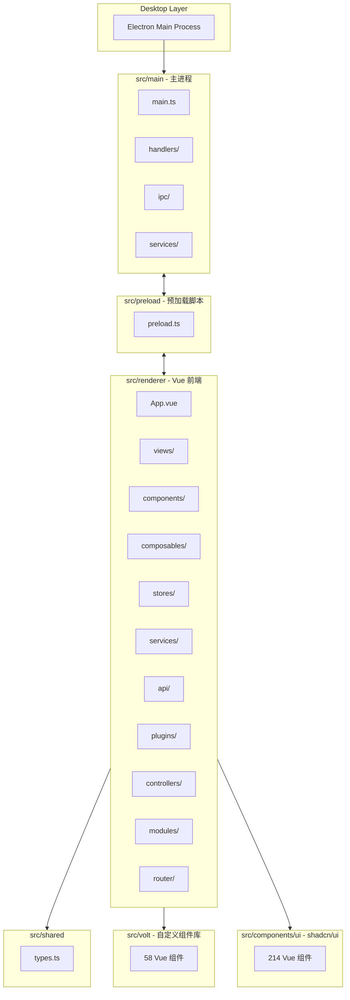
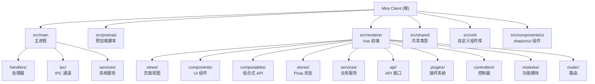

[根目录](../../CLAUDE.md) > [packages](..) > **mira-client**

# mira-client

## 变更记录 (Changelog)

| 日期 | 操作 | 说明 |
|------|------|------|
| 2026-05-20 | 架构扫描更新 | 更新根级导航面包屑；补充 monorepo 上下文信息 |
| 2026-05-12 | 全量初始化扫描 | 阶段A全仓清点 + 阶段B模块优先扫描 + 阶段C深度补捞；覆盖 6 大模块、27 个已有 CLAUDE.md |

## 项目愿景

Mira 是一个基于 Electron 的桌面媒体库管理客户端，采用 Vue 3 + TypeScript + Shadcn-vue 构建。通过客户端-服务器架构（mira-server-sdk），提供媒体文件的整理、查看、搜索和管理功能，支持插件扩展、自定义协议、全局搜索等高级特性。

本模块是 Mira TypeScript monorepo 中的桌面客户端组件，与服务端 `mira-app-server` 和 SDK `mira-server-sdk` 协同工作。

## 架构总览



## 模块结构图 (Mermaid)



## 关键技术

- **前端**: Vue 3, TypeScript, Shadcn-vue, Tailwind CSS
- **桌面**: Electron 多进程架构 (main, renderer, preload)
- **状态管理**: Pinia + 持久化存储
- **构建工具**: Vite + 多进程自定义配置
- **SDK**: mira-server-sdk (后端通信)

## 模块索引

| 模块 | 路径 | 语言 | 文件数 | 描述 |
|--------|------|------|--------|------|
| **主进程** | `src/main/` | TS | 21 | 应用生命周期、窗口管理、IPC 处理器、系统服务 |
| **预加载脚本** | `src/preload/` | TS/JS | 3 | 主进程与渲染进程的安全桥梁 |
| **渲染进程** | `src/renderer/` | TS/Vue | ~221 | Vue.js 前端应用（核心业务逻辑） |
| **共享类型** | `src/shared/` | TS | 1 | 跨进程共享的 TypeScript 类型定义 |
| **Volt 组件库** | `src/volt/` | Vue/TS | 58 | 自定义 Vue 组件库（50+ 组件） |
| **shadcn/ui 组件** | `src/components/ui/` | Vue/TS | 214 | 基于 shadcn/ui 的 UI 基础组件 |
| **类型声明** | `src/types/` | TS | 2 | 全局 TypeScript 类型声明 |

## 运行与开发

```bash
# 开发
pnpm run dev                    # 启动 Vite 开发服务器
pnpm run electron:dev          # Electron 开发模式
pnpm run electron:dev:mac      # macOS Electron 开发模式
pnpm run electron:start        # 启动 Electron

# 构建
pnpm run build                 # 构建渲染进程
pnpm run build:all             # 构建所有进程 (renderer + main + preload)
pnpm run build:main            # 仅构建主进程
pnpm run build:preload         # 仅构建预加载脚本
pnpm run build:prod            # 生产环境构建

# Electron 打包
pnpm run electron:build        # 打包当前平台
pnpm run electron:build:win    # 打包 Windows
pnpm run electron:build:mac    # 打包 macOS

# 代码质量
pnpm run lint                  # ESLint 自动修复
pnpm run type-check            # TypeScript 类型检查
pnpm run docs                  # 生成 TypeDoc 文档

# 工具
pnpm run clean                 # 清理构建目录
pnpm run analyze:deps          # 依赖图分析
pnpm run analyze:bundle        # 包体积分析
```

## Electron 进程结构

- **主进程** (`src/main/`): 应用生命周期、窗口管理、IPC 处理器、系统服务
- **渲染进程** (`src/renderer/`): Vue.js 前端应用
- **预加载脚本** (`src/preload/`): 主进程与渲染进程之间的安全桥梁

### 前端架构

- **Views** (`src/renderer/views/`): 页面级组件 (HomeView, SettingsView, LoginView 等)
- **Components** (`src/renderer/components/`):
  - `layout/`: 布局组件 (ContentToolbar)
  - `business/`: 业务组件 (MediaGrid, VideoPlayer, FolderTree 等 30+)
  - `common/`: 通用 UI 组件 (TabViewRenderer, SelectionBox 等)
  - `preview/`: 预览组件 (视频/图片/音频/文档)
  - `search/`: 搜索组件
  - `tabs/`: Tab 视图组件 (HomeTabView, MediaTabListView)
- **Composables** (`src/renderer/composables/`):
  - `TabRegistry.ts`: Tab 注册系统
  - `TabTypes.ts`: Tab 类型基类
  - `useTabs.ts`: Tab 管理 (核心)
  - `tabs/`: 7 种内置 Tab 类型定义
- **API** (`src/renderer/api/`):
  - `MiraAPI.ts`: 后端 API 统一封装
  - `TabRegistryAPI.ts`: Tab 注册公共 API
- **Stores** (`src/renderer/stores/`): 10 个 Pinia Store
- **Controllers** (`src/renderer/controllers/`): 业务逻辑控制器
- **Volt** (`src/volt/`): 58 个自定义 Vue 组件

### 状态管理

使用 Pinia 持久化存储:

| Store | 文件 | 描述 |
|-------|------|------|
| AuthStore | `auth.ts` | 用户认证和会话管理 |
| LibraryStore | `library.ts` | 媒体库管理 |
| MediaStore | `media.ts` | 媒体文件核心状态 |
| SettingsStore | `settings.ts` | 应用配置和服务器设置 |
| PluginStore | `plugin.ts` | 插件市场和管理 |
| FolderStore | `folder.ts` | 文件夹管理 |
| TagStore | `tag.ts` | 标签管理 |
| ServerListStore | `serverList.ts` | 服务器列表 |
| UploadHistoryStore | `uploadHistory.ts` | 上传历史 |
| AppStateStore | `appState.ts` | 应用全局状态 |

### Tab 系统架构

基于视图的标签页系统，每个标签页对应一个 Vue 组件。内置 Tab 类型：HomeTabType, AllTabType, FolderTabType, TagTabType, TrashTabType, UncategorizedTabType, UntaggedTabType。

**生命周期钩子**: `onInit` / `onActive` / `onInactive` / `onClose`

### 插件系统

`src/renderer/plugins/` 实现完整的插件架构:

| 模块 | 描述 |
|------|------|
| `instanceManager.ts` | 插件实例生命周期管理 |
| `operationManager.ts` | 插件操作管理 |
| `scriptManager.ts` | 脚本加载和沙箱执行 |
| `storage.ts` | 插件数据持久化 |

## 路径别名

```typescript
"@/*": ["./src/*"]
"@renderer/*": ["./src/renderer/*"]
"@main/*": ["./src/main/*"]
"@volt/*": ["./src/volt/*"]
```

## 测试策略

项目当前以开发时类型检查为主（`pnpm run type-check`）。尚未建立自动化测试框架。

## 编码规范

- TypeScript strict 模式启用
- ESLint + @typescript-eslint 规则集
- Vue 3 Composition API 风格 (`<script setup>`)
- 组件按功能分层: views / components / composables / services / stores
- 全局 API 通过 `MiraAPI` 单例统一导出
- 跨进程类型通过 `src/shared/types.ts` 共享

## 安全机制

- Electron Context Isolation: 启用
- Node Integration: 禁用
- Preload Scripts: 强制使用
- IPC 通信: 通过 `contextBridge.exposeInMainWorld` 暴露安全 API

## AI 使用指引

- 修改前端 UI 逻辑时，优先查阅 `src/renderer/components/` 和 `composables/`
- Tab 系统修改需参考 `TabRegistry.ts` + `TabTypes.ts` + `tabs/` 目录
- 状态管理修改需参考 `stores/` 目录，所有 Store 支持持久化
- 插件系统修改需参考 `plugins/` 目录的 4 个管理器
- IPC 通信修改需同时更新 `src/main/ipc/` 和 `src/preload/preload.ts`
- 共享类型修改需更新 `src/shared/types.ts`
- 路由修改需更新 `src/renderer/router/index.ts`
