# Mira 应用加载流程逻辑图

```mermaid
graph TD
    A[应用启动] --> B[初始化Vite开发环境]
    B --> C[执行main.ts]

    C --> D[创建Vue应用实例]
    D --> E[安装Pinia状态管理]
    E --> F[配置路由器]
    F --> G[配置UI库]

    G --> H[initializeApp函数]
    H --> I[初始化Settings Store]
    I --> I1{插件系统是否已初始化?}
    I1 -->|否| I2[从localStorage加载设置]
    I1 -->|是| I3[跳过插件初始化]
    I2 --> I4[应用主题设置]
    I3 --> I4
    I4 --> J[检查Electron环境]

    J -->|是Electron| K[初始化菜单服务]
    J -->|不是Electron| L[跳过原生功能]
    K --> L
    L --> M[挂载Vue应用到DOM]

    M --> N[App.vue组件挂载]
    N --> O[检查应用初始化状态]
    O --> P{需要初始化?}

    P -->|是| Q[启动InitializationService.initializeApp]
    P -->|否| Z[直接进入应用]

    Q --> R[显示初始化加载器]
    R --> S[步骤1: 加载素材库配置]
    S --> T[步骤2: 初始化插件系统]

    T --> T1[GlobalPluginManager.initialize]
    T1 --> T2[检查是否已初始化]
    T2 -->|否| T3[执行插件系统初始化]
    T2 -->|是| T7[跳过初始化]

    T3 --> T4[加载插件配置]
    T4 --> T5[调用pluginStore.initializeLocalPlugins]
    T5 --> T6[发现并加载本地插件]
    T6 --> T7[标记插件系统已初始化]
    T7 --> T8[步骤3: 启用所有插件]

    T8 --> T9[GlobalPluginManager.enableAllPlugins]
    T9 --> T10[并行启用每个插件]
    T10 --> T11[验证插件实例创建]
    T11 --> T12{所有插件都成功启用?}
    T12 -->|是| U[步骤4: 连接服务器]
    T12 -->|否| T13[抛出错误 - 阻止应用启动]

    U --> U1[检查连接状态]
    U1 -->|未连接| U2[执行连接操作]
    U1 -->|已连接| V[步骤5: 验证用户身份]
    U2 --> U3[调用MiraSDKService.connect]
    U3 --> U4[同步服务器库列表]
    U4 --> V

    V --> V1[检查登录状态]
    V1 -->|未登录| V2[从localStorage恢复认证]
    V1 -->|已登录| W[初始化完成]
    V2 --> V3[验证token有效性]
    V3 --> W

    W --> X[隐藏初始化加载器]
    X --> Y[应用进入READY状态]
    Y --> Z[用户可以正常使用应用]

    Z --> AA[用户导航到HomeView]
    AA --> BB[HomeView初始化]
    BB --> CC[启动InitializationService.initializeHomeView]

    CC --> DD[步骤1: 检查用户认证]
    DD --> EE[步骤2: 获取素材库列表]
    EE --> FF[步骤3: 选择默认素材库]
    FF --> GG[步骤4: 加载媒体文件]
    GG --> HH[步骤5: 加载文件夹结构]
    HH --> II[步骤6: 加载标签列表]
    II --> JJ[主页数据加载完成]

    JJ --> KK[插件实例自动启用]
    KK --> LL[应用完全就绪]

    %% 错误处理流程
    T3 -.->|失败| T14[插件初始化失败-记录警告]
    T14 -.-> T8
    T12 -.->|否| T13
    T13 -.-> T15[显示错误信息并停止初始化]
    U2 -.->|失败| U5[连接失败-显示错误]
    V2 -.->|失败| V4[认证失败-要求重新登录]

    %% 样式
    classDef startEnd fill:#e1f5fe,stroke:#01579b,stroke-width:2px
    classDef process fill:#f3e5f5,stroke:#4a148c,stroke-width:2px
    classDef decision fill:#fff3e0,stroke:#e65100,stroke-width:2px
    classDef critical fill:#ffebee,stroke:#b71c1c,stroke-width:2px
    classDef plugin fill:#e8f5e8,stroke:#2e7d32,stroke-width:2px

    class A,LL startEnd
    class B,C,D,E,F,G,H,I,J,K,L,M,N,Q,R,S,U,V,W,X,Y,Z,AA,BB,CC,DD,EE,FF,GG,HH,II,JJ process
    class O,P,I1,T2,U1,V1 decision
    class U2,U3,V2,V3 critical
    class T,T1,T3,T4,T5,T6,T7,KK plugin
```

## 关键优化点

### 1. 防重复初始化机制
- **Settings Store**: 使用 `isPluginSystemInitialized` 标志防止重复初始化
- **GlobalPluginManager**: 使用 `isInitialized` 状态和 `initializationPromise` 防止并发初始化
- **插件发现**: 移除了重复的 `discoverLocalPlugins()` 调用

### 2. 初始化顺序保证
1. **Settings配置** → **插件系统** → **启用所有插件** → **服务器连接** → **用户认证**
2. 确保插件在连接服务器前完全加载和启用
3. 严格验证所有插件都成功启用后才允许连接服务器
4. 认证状态恢复在连接建立后进行

### 3. 错误处理策略
- **插件系统初始化失败**: 不阻止应用启动，仅记录警告
- **插件启用失败**: **严格模式** - 阻止应用启动，要求所有插件都成功启用
- **插件实例验证**: 确保插件不仅启用成功，还要验证实例确实创建
- **连接失败**: 显示错误信息，允许用户重试
- **认证失败**: 引导用户重新登录

### 4. 用户体验优化
- **渐进式加载**: 分步显示初始化进度
- **可视化反馈**: 进度条和步骤提示
- **非阻塞设计**: 关键功能失败不影响应用核心功能

## 性能优化

### 1. 减少重复操作
- ✅ 插件系统只初始化一次
- ✅ Settings配置复用
- ✅ 避免重复的插件发现和加载
- ✅ 插件启用过程中的实例验证

### 2. 并发优化
- 系统信息和健康检查并行获取
- 库列表同步与连接检查并行
- **插件并行启用**: 所有插件同时启用，提升启动速度
- 主页数据加载步骤化，避免阻塞

### 3. 缓存机制
- Settings持久化到localStorage
- 认证状态本地缓存
- 连接配置复用